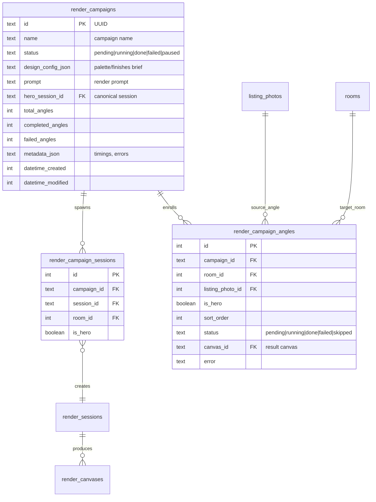
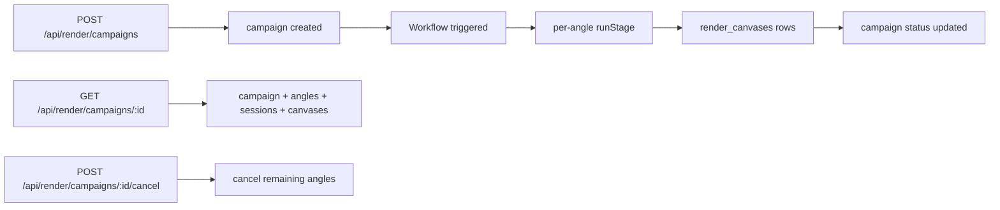
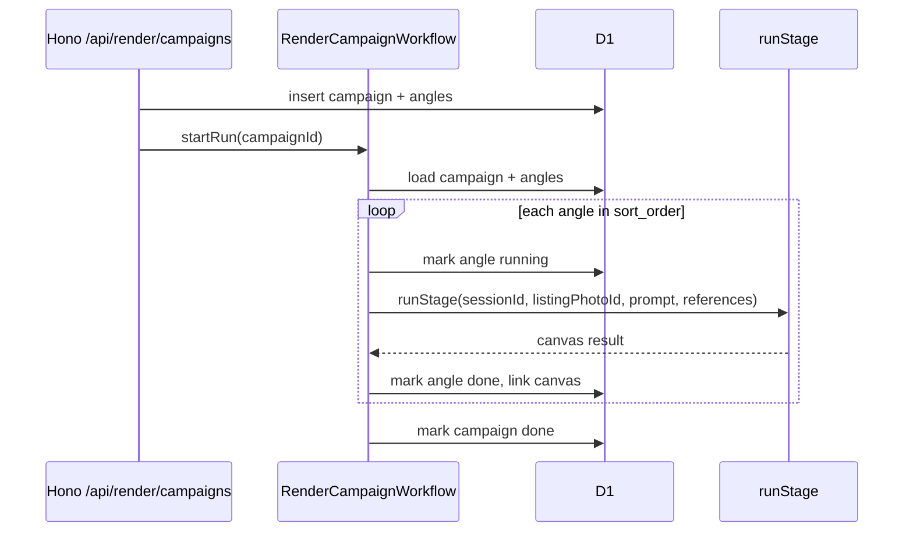

# 0048 — Multi-Room Multi-Angle Render Campaigns (MCP Code Mode)

**Slug:** `multi-room-render`  
**Status:** planning  
**Branch:** `claude/multi-room-render`

---

## 1. Problem

The existing render pipeline is room-scoped: a `render_sessions` row belongs to one room, and `/api/render/looks` can only render the angles of that single room. There is no way to:

- Apply one design brief / material palette across multiple rooms.
- Render every angle of every room in a floor or a whole house from a single orchestration call.
- Track the progress of a multi-room campaign in one place.
- Drive the work from the canonical OAuth MCP server (the one that will become Code Mode in 0044).

The local kitchen proofs (`kitchen_render.py`, `batch_image_edit_kitchen.py`) show the desired behavior — per-angle prompts, coordinate anchors, material overrides, staged pipeline — but they are not wired into the deployed Worker.

---

## 2. Goal

Add a **render campaign** abstraction that lets a user or agent say *"render this design across these rooms and angles"* and get back a durable, trackable set of canvases. Expose the operation through the canonical OAuth MCP tool registry so it is available to code-mode agents.

---

## 3. Non-goals

- Do **not** implement the full 0044 Code Mode upgrade (single `code` tool, Dynamic Worker executor, durable approvals). That is a separate body of work.
- Do **not** replace the existing room-scoped `render_sessions` / `render_canvases` model. Extend it.
- Do **not** port every local kitchen-script feature in one PR. This PR focuses on campaign orchestration + multi-angle rendering; per-angle prompt templates and coordinate anchors are follow-ups.
- Do **not** add new AI providers. Reuse the existing `runStage` provider factory.

---

## 4. Proposed solution

### 4.1 Data model

Introduce two new tables:

- `render_campaigns` — a campaign groups rooms/angles under one design brief.
- `render_campaign_sessions` — junction linking a campaign to the per-room `render_sessions` it created.



### 4.2 API surface

New Hono routes under `/api/render/campaigns`:



- `POST /api/render/campaigns` — create a campaign from `{ name, prompt, designConfig, angles: [{roomId, listingPhotoId, isHero?}] }`.
- `GET /api/render/campaigns/:id` — full campaign detail.
- `POST /api/render/campaigns/:id/cancel` — cancel pending angles.

### 4.3 Workflow

A new Cloudflare Workflow (`render-campaign-workflow.ts`) processes the campaign:



Hero-angle handling:

1. Render the hero angle first.
2. For each remaining angle in the same campaign, pass the hero canvas output as a `ReferenceImage` so the model keeps materials/layout consistent across rooms.

### 4.4 MCP tools (canonical OAuth registry)

New tools in `src/backend/mcp/tools/render/`:

- `create_render_campaign` — create and optionally start a campaign.
- `list_render_campaigns` — list campaigns with status.
- `get_render_campaign` — full campaign detail.
- `cancel_render_campaign` — cancel pending work.
- `run_room_looks` — convenience wrapper around `/api/render/looks` for a single room (exposes existing capability).

These are registered in the main MCP registry, so they are available to the OAuth connector and will be callable from Code Mode once 0044 lands.

### 4.5 Frontend

A lightweight admin page `/admin/render/campaigns` and `/admin/render/campaigns/[id]`:

- List campaigns with status chips.
- Campaign detail: grid of angles, thumbnails, progress bar, per-angle status.
- Reuses existing `AngleGallery`, `StageExplorer`, `PipelineStatusLoader` components and `useRenderRealtime` hook.

```mermaid
flowchart TD
    subgraph Admin
        A[/admin/render/campaigns] --> B[CampaignListApp]
        C[/admin/render/campaigns/:id] --> D[CampaignDetailApp]
    end
    D --> E[GET /api/render/campaigns/:id]
    D --> F[useRenderRealtime]
    B --> G[GET /api/render/campaigns]
```

---

## 5. Schema / API / MCP deltas

### 5.1 D1 schema (drizzle)

New files:

- `src/backend/db/schema/images/render_campaigns.ts`
- `src/backend/db/schema/images/render_campaign_angles.ts`
- `src/backend/db/schema/images/render_campaign_sessions.ts`

Migration generated via `pnpm run db:generate`.

### 5.2 API routes

- Extend `src/backend/api/routes/render.ts` with `/campaigns/*` routes.
- New service module `src/backend/services/render/campaign.ts` for campaign CRUD.
- New Workflow `src/backend/services/render/render-campaign-workflow.ts`.
- Register the Workflow in `wrangler.jsonc` and re-export from `src/_worker.ts`.

### 5.3 MCP tools

New domain folder `src/backend/mcp/tools/render/`:

- `create_render_campaign.ts`
- `list_render_campaigns.ts`
- `get_render_campaign.ts`
- `cancel_render_campaign.ts`
- `run_room_looks.ts`
- `_shared.ts`
- `index.ts`

Add `renderTools` to `ALL_TOOL_GROUPS` in `src/backend/mcp/tools/index.ts`.

### 5.4 Frontend

- `src/frontend/pages/admin/render/campaigns.astro`
- `src/frontend/pages/admin/render/campaigns/[id].astro`
- `src/frontend/components/render/CampaignListApp.tsx`
- `src/frontend/components/render/CampaignDetailApp.tsx`

---

## 6. Phases / tasks

| Phase | Task | Files | Change type |
|---|---|---|---|
| P1 | Add `render_campaigns`, `render_campaign_angles`, `render_campaign_sessions` schema | `src/backend/db/schema/images/*` | migration |
| P1 | Generate & inspect migration | `drizzle/01XX_*` | migration |
| P2 | Add campaign service (`create`, `get`, `cancel`, `list`) | `src/backend/services/render/campaign.ts` | backend |
| P2 | Add `/api/render/campaigns/*` routes | `src/backend/api/routes/render.ts` | backend |
| P3 | Add `RenderCampaignWorkflow` | `src/backend/services/render/render-campaign-workflow.ts` | backend |
| P3 | Register workflow in `wrangler.jsonc` and `src/_worker.ts` | `wrangler.jsonc`, `src/_worker.ts` | infra |
| P4 | Add MCP tools in canonical registry | `src/backend/mcp/tools/render/*` | mcp |
| P5 | Build admin campaign list/detail pages | `src/frontend/pages/admin/render/*`, `src/frontend/components/render/*` | frontend |
| P6 | QC script + changelog + preview deploy | `scripts/qc/pr_*.mjs`, `src/frontend/data/changelog.ts` | ops |

---

## 7. Risks / mitigations

| Risk | Mitigation |
|---|---|
| Long campaigns hit request/Workflow limits | Use Cloudflare Workflow with step-level retries; process angles sequentially in v1. |
| Hero-reference consistency across rooms fails | Pass hero output as `ReferenceImage` with explicit "match this exactly" prompt clause; surface per-angle status so failures are visible. |
| Concurrent campaigns race on provider quota | Workflow wave size + existing `runWithFailover` step-down handles transient faults. |
| Schema migration conflicts with other branches | Migration additive only; no renames/drops. |
| Frontend page breaks existing StudioBuilder | Reuse existing types/components; do not mutate `StudioBuilder` state model. |

---

## 8. Success criteria

- `create_render_campaign` MCP tool returns a campaign id and starts rendering all enrolled angles.
- `GET /api/render/campaigns/:id` returns campaign status, angles, sessions, and resulting canvas ids.
- Hero angle is rendered first; remaining angles receive it as a consistency reference.
- Campaign survives isolate churn/redeploy via Workflow persistence.
- Admin page lists campaigns and shows per-angle progress with realtime updates.
- Existing `/api/render/looks` and room-scoped render flows continue to work.
- `pnpm run build`, `pnpm run check`, and `NODE_OPTIONS=--max-old-space-size=8192 npx tsc --noEmit` pass.

---

## 9. Verification

- Unit-style service tests via QC script `scripts/qc/pr_<n>.mjs`:
  - Create campaign for 2 rooms × 2 angles.
  - Poll campaign detail until done/failed.
  - Assert hero canvas exists and non-hero canvases reference it.
  - Cancel a pending campaign and verify status.
- MCP tool smoke via `/api/mcp-docs` and direct tool invocation.
- Frontend manual: open `/admin/render/campaigns`, create campaign, watch realtime progress.
