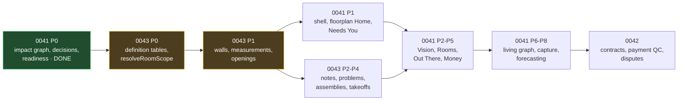
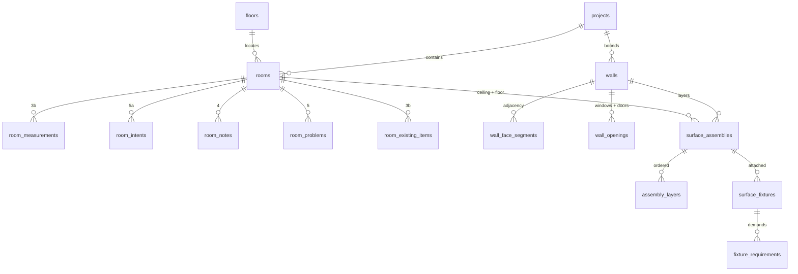
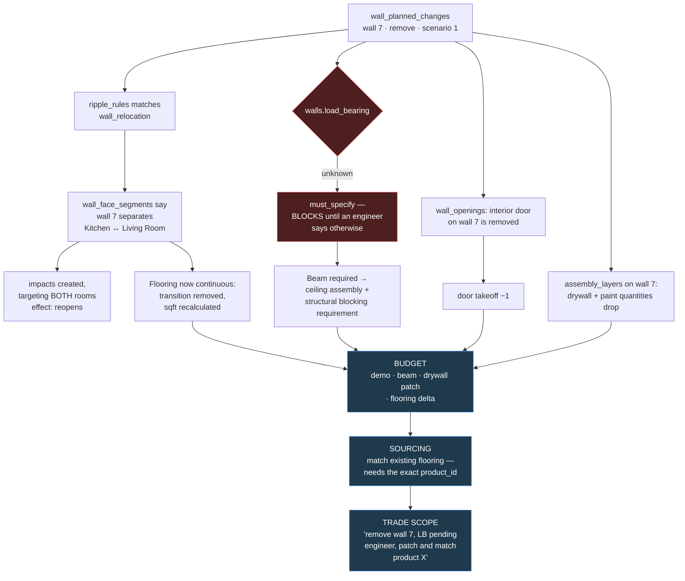

# Planning package — the homeowner product

> **Assembled 2026-08-02.** One entry point for three plans that only make sense together.
> Nothing here supersedes the individual plans; this is the map, the restructure, and the chain that connects them.

---

## 1 · The three plans, and why they are three

| Plan | Owns | State |
|---|---|---|
| **[0041 Homeowner Experience](0041_homeowner_experience/IMPLEMENTATION_PLAN.md)** | The public product: six destinations, the impact graph, decisions, readiness, forecasting | Phase 0 **built and applied to remote**; 4 tasks reopened by review |
| **[0042 Contracts & Disputes](0042_contracts_disputes/IMPLEMENTATION_PLAN.md)** | Machine-readable contracts, payment QC, the dispute record, lien clocks | Planned |
| **[0043 Room Model Overhaul](0043_room_model_overhaul/IMPLEMENTATION_PLAN.md)** | Rooms, walls, measurements, assemblies, fixtures, finishes — the physical model | Planned |

**They split by what they are made of, not by feature area.** 0041 is a *decision and disruption* graph. 0043 is a *physical* graph. 0042 is a *document and obligation* graph. Each one's tables are meaningless without its own spine, and each one references the other two by id rather than duplicating them.

### The sequencing problem, stated plainly

**0041 Phase 1 cannot be built before 0043 Phase 0–1.** The Home screen renders rooms with money and state; the room screen renders specs. Both assume a room model that 0043 is about to restructure — and building a UI on `rooms.lengthFeet` weeks before it is deprecated means building it twice.

**Recommended order: finish 0043 Phase 0–1 next, not 0041 Phase 1.**

---

## 2 · Restructuring the schema around rooms and walls

### What exists today

| Table | Role | Fate |
|---|---|---|
| `rooms` | Identity **plus** measurements, notes, problems as loose columns | **Keep as identity.** Everything else moves out; columns deprecated in place, never dropped |
| `floors` | Physical storeys — plus `all_levels`, a scope marker in disguise | Keep; retire `all_levels`; add `is_physical` |
| `measurements` | As-is dimensional ledger, `element_type` polymorphic, 14 rows | **Keep and extend.** Migrate feet+inches → canonical inches |
| `remodel_scenarios` / `scenario_room_plans` | To-be room plans, already modelling use-change | **Keep and build on.** This is the tense axis |
| `material_schedule_items` | Per-room materials | Keep; gains `material_type_id` |
| `products` (export `showroomStoreProducts`) | Purchasable things | Keep; the fit-check target |
| `budget_tracker_items` | Money | Keep; gains provenance from takeoffs and problems |
| `permits_records` | Property-scoped permits | Keep; gains a room mapping and a jurisdiction capability |
| `images` | CF Images, dedupe, soft-delete, room FK | Keep; problem photos FK here rather than storing URLs |

### The one constraint that shapes every migration

**Columns cannot be safely dropped from `rooms`.** A SQLite column drop rebuilds the table, and on D1 rebuilding a parent with children is the documented way child data silently disappears. `rooms` has many children.

So the pattern is always: **add → backfill → stop writing → deprecate in the docstring → leave in place.**

### What `rooms` becomes

`rooms` keeps: identity, floor, code, name, active flag, tint, order, floorplan position. **Everything else leaves.**

`walls` is **project-scoped, not room-scoped** — one wall separates two spaces, and storing it per-room means two copies that disagree.

---

## 3 · The definition-table layer — the enums that drive logic

This is the answer to *"system tables to capture important details in enums we can build solid API logic around."*

**The rule: a vocabulary that will ever grow is a table, not a TypeScript enum.** A hardcoded enum means every new tile format, impact kind, or note type is a migration and a deploy. A definition row is configuration. Where a value genuinely cannot grow — a room stop, a confidence level — an enum is correct because adding one changes the *logic*, not just the data.

| Table | Vocabulary | Drives |
|---|---|---|
| **`impact_definitions`** ✅ | ripple, party, schedule, money, field, external | `riskInputs` declares which columns feed scoring — a new kind is a row |
| **`spec_definitions`** ✅ | what a room can specify | `isRequiredForThreshold` gates `roomReadiness()` |
| **`ripple_rules`** ✅ | trigger → consequence | The one engine behind ripples, material applicability, **and** scoping questions |
| `room_intent_type_def` | OUT_OF_SCOPE → FULL_REMODEL | `scope_level` + which specs become required |
| `room_use_def` | kitchen, bath, office | Replaces free-text `asIsUse` / `proposedUse` so a swap can actually match |
| `room_type_def` | wet, dry, circulation, utility | Which material types are even offered |
| `material_type_def` | FLOORING, WALL_FINISH, DOOR, WINDOW, LIGHTING… | `scope_granularity`, `takeoff_unit`, `default_waste_factor`, applicability |
| `room_note_type_def` | plumbing, electrical, structural | Note typing; many per note |
| `room_problem_type_def` | leak, mold, code compliance | Problem typing; many per problem |
| `room_problem_fix_def` | remediation, drainage | Fix vocabulary with cost and owner |
| `paint_sheen_def` | flat → high-gloss | Sheen validation independent of the product's own claim |
| `tile_format_def` | mosaic → slab | `defaultRequiresLeveling` |
| `tile_install_profile_def` | substrate + waterproofing + thinset + grout + pattern | A named, reusable stack |
| `fixture_type_def` | TV mount, floating vanity, rainfall head | **Carries the requirements a fixture imposes** |
| `assembly_layer_kind_def` | stud, insulation, MLV, drywall, membrane, finish | New technique = row, not migration |
| `jurisdiction_capability_def` | permit search, inspection history, parcel keys | Whether permits sync or are manual entry |

✅ = built and applied to remote this session.

### Where enums are still correct

`room_stop_state.stop`, `confidence`, `impact_targets.effect`, `resolution`, `photo_type`. These are **closed sets where adding a member changes code**, so a definition row would be a lie — you cannot add a sixth stop without teaching `roomReadiness()` what it means.

---

## 4 · The chain — how a distinction becomes a budget line

> **measurement → distinction → rule → impact/requirement → material → quantity → budget → sourcing → trade**

This is the whole point of the detail. A distinction that does not move something along this chain was not worth capturing.

### Worked example A — "remove the wall between the kitchen and the living room"

**Every arrow is data, not inference.** The system knows both rooms are affected because `wall_face_segments` says so. It knows a door disappears because `wall_openings` says so. It knows the flooring needs matching because `assembly_layers` holds the existing product id. Without the wall graph, all of that is a homeowner remembering.

### Worked example B — "replace all the interior doors"

| Step | Mechanism |
|---|---|
| Stepper: *whole house* | `resolveRoomScope()` fans to every active room, records the intent |
| Which doors? | `material_type_def.scope_granularity = wall` → the question becomes wall-scoped |
| How many? | `COUNT(wall_openings WHERE kind = interior_door)` — a real number, not an estimate |
| What sizes? | Each opening's `width_inches` / `height_inches` |
| **Will this one fit?** | Candidate product height vs `room_measurements.ceiling_height_inches` — **the 8-foot-door-in-an-8-foot-hallway catch** |
| Budget | count × unit price, per room, in the room's tint |
| Sourcing | *"I need 9 interior doors: six at 30×80, two at 28×80, one at 24×80"* — a showroom conversation that takes two minutes instead of a site visit |

### Why the ripple engine is one engine

`ripple_rules` now serves three jobs, and that convergence is the strongest evidence the abstraction is right:

1. **Physical ripples** — move a wall, plumbing and electrical follow.
2. **Material applicability** — tile whole-house, `must_confirm` the bathrooms; hardwood, `auto_exclude` them.
3. **Scoping questions** — bathroom + `FULL_REMODEL` → *"will the vanity be wall-hung?"* → blocking + weight requirements.

All three are trigger → consequence → resolution. Three engines would drift.

---

## 5 · Build order

| # | Plan | Phase | Why here |
|---|---|---|---|
| 1 | 0043 | **P0** definition tables + `resolveRoomScope` | Everything fans out through it |
| 2 | 0043 | **P1** walls, measurements, openings | The only hard requirement; makes every other question addressable |
| 3 | 0041 | **P1** shell, floorplan Home, Needs You | Now safe — the room model is settled |
| 4 | 0043 | **P2–P3** notes, problems, intents | `roomReadiness()` intent fix lands here |
| 5 | 0041 | **P2–P3** Vision, Rooms | The room screen renders the real model |
| 6 | 0043 | **P4** assemblies, fixtures, takeoffs | The chain closes: measurement → budget |
| 7 | 0041 | **P4–P5** Out There, Money | Sourcing and budget consume takeoffs |
| 8 | 0041 | **P6–P8** living graph, capture, forecasting | Voice capture writes into the wall model |
| 9 | 0042 | all | Contracts and disputes assume everything above |

---

## 6 · Open decisions, consolidated

**Product — yours**

- Product name · pricing and paywall boundaries · tenant and partner-co-ownership model · contractor auth vs. token links
- Whether the trade-ready vendor package is in v1 — the only one that could still move Phase 0 schema
- Doctrine §14 Q01 / Q05 / Q06

**Modelling — recommendation given, needs a call**

- Do `room_intents` collide with `scenario_room_plans`? *Recommend: intent is committed, scenarios propose against it*
- Do materials belong to **the space** or **the use** across a swap? *Recommend: the space* — **caveat truncated mid-sentence and never received**
- Should `room_problems` be visible to bidders, or operator-only until a fix is scoped?
- Multi-room problems, or per-room plus a shared impact? *Recommend: the latter*

**Carried, unresolved**

- The shower / opening measurement detail, truncated mid-example
- `"we need to be careful so that if a…"` — the materials caveat, never completed
