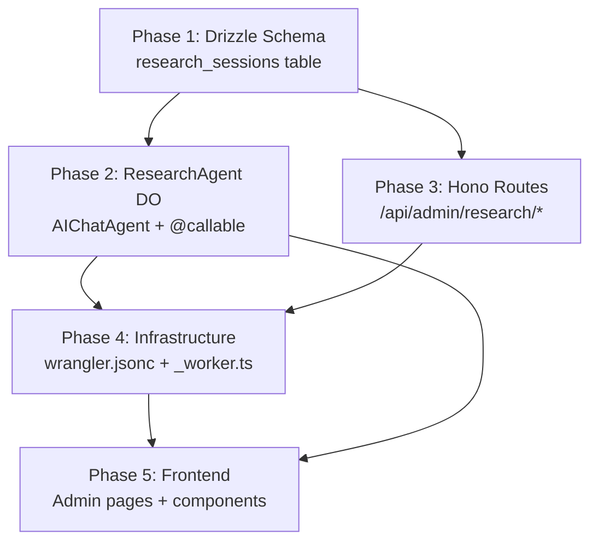

# Home Remodel Research Center — Implementation Plan

An AI-powered deep research platform integrated into the existing core-remodel Cloudflare Worker. Admin initiates a "Gemini Deep Research" prompt → the backend orchestrates research via Gemini → saves findings to R2 → embeds into Vectorize for RAG → indexes in D1 → generates an interactive visualizer webapp served via Dynamic Workers → users browse the research library, view the visualizer, download PDF reports, and chat with research context via `assistant-ui`.

---

## User Review Required

> [!IMPORTANT]
> **Dynamic Worker LOADER binding**: The existing `wrangler.jsonc` does NOT have a `worker_loaders` binding. I will add one (binding name: `LOADER`). The `worker-configuration.d.ts` already has `LOADER?: any` typed. Please confirm this binding is available on your Cloudflare Paid Plan.

> [!IMPORTANT]
> **Vectorize namespace strategy**: The existing Vectorize binding (`VECTOR_INDEX` → `remodel-embeddings`) is shared with the `RenovationAgent`'s image embeddings. Research embeddings will use a **namespace prefix** (`research:{sessionId}`) to isolate research vectors from image vectors within the same index. Alternatively, we could create a **second Vectorize index** dedicated to research. Which do you prefer?

> [!WARNING]
> **react-pdfx**: This package is referenced in the spec but may not exist as a published npm package. I'll use `@react-pdf/renderer` (battle-tested) as the PDF generation library instead. Please confirm or provide the correct package name.

## Open Questions

1. **Gemini model selection**: The spec says "Gemini Deep Research." Should I use `gemini-2.5-pro` (best reasoning) or `gemini-2.5-flash` (faster, cheaper) for the research generation? I'll default to `gemini-2.5-pro` for quality.
2. **Visualizer complexity**: The generated React/HTML webapp from Gemini will be a single-file artifact. Should it include Tailwind CDN + Recharts CDN for rich visuals, or keep it vanilla HTML/CSS/JS for sandbox safety?
3. **Auth gating**: Research is admin-only. The existing `requireAccessAuth` middleware is already applied to `/api/admin/*`. The research routes will live under `/api/admin/research/*`. Confirm this is sufficient.
4. **Public access**: Should end-users (non-admin) ever be able to view completed research? If yes, I'll add a public route. Defaulting to admin-only.

---

## Proposed Changes

### Phase 1: Database Layer (Drizzle + D1)

#### [NEW] [research_sessions.ts](file:///Volumes/Projects/workers/core-remodel/src/backend/db/schema/admin/research_sessions.ts)

New Drizzle schema file for the `research_sessions` table:

```typescript
// Fields:
id: integer("id").primaryKey({ autoIncrement: true })
topic: text("topic").notNull()
status: text("status", { enum: ["pending", "researching", "embedding", "generating", "complete", "failed"] }).notNull().default("pending")
r2MarkdownKey: text("r2_markdown_key")     // R2 object key for raw markdown
r2WebappKey: text("r2_webapp_key")         // R2 object key for generated visualizer code
vectorNamespace: text("vector_namespace")   // Vectorize namespace tag
errorMessage: text("error_message")         // Failure reason if status=failed
chunkCount: integer("chunk_count")          // Number of embedded chunks
createdAt: integer("created_at", { mode: "timestamp" }).notNull().default(sql`(unixepoch())`)
completedAt: integer("completed_at", { mode: "timestamp" })
```

#### [MODIFY] [index.ts](file:///Volumes/Projects/workers/core-remodel/src/backend/db/schema/index.ts)

Add `export * from "./admin/research_sessions"` barrel export.

---

### Phase 2: ResearchAgent (Cloudflare Agents SDK)

#### [NEW] [types.ts](file:///Volumes/Projects/workers/core-remodel/src/backend/ai/agents/ResearchAgent/types.ts)

Agent state interface and Zod schemas:

```typescript
interface ResearchAgentState {
  currentSessionId: number | null;
  currentTopic: string | null;
  status: "idle" | "researching" | "embedding" | "generating" | "complete" | "failed";
  progress: string;   // Human-readable progress message
  chunkCount: number;
}
```

#### [NEW] [index.ts](file:///Volumes/Projects/workers/core-remodel/src/backend/ai/agents/ResearchAgent/index.ts)

`ResearchAgent` extending `AIChatAgent<Env>` with:

**`@callable()` methods:**

1. **`startResearch(topic: string)`** — The main orchestration pipeline:
   - Update D1 `research_sessions` → status: `researching`
   - Call Gemini API (`gemini-2.5-pro`) via `@google/genai` through AI Gateway (same pattern as [image-editor.ts](file:///Volumes/Projects/workers/core-remodel/src/backend/services/image-processor/image-editor.ts))
   - Save raw Markdown to R2 (`env.ARTIFACTS_BUCKET`) → key: `research/{sessionId}/report.md`
   - Chunk the Markdown (respecting 512-token limit for `bge-large-en-v1.5`)
   - Generate embeddings via `env.AI.run("@cf/baai/bge-large-en-v1.5", { text: chunks })`
   - Upsert vectors into Vectorize with namespace `research:{sessionId}`
   - Prompt Gemini to generate a single-file React/HTML/Tailwind visualizer dashboard
   - Save visualizer code to R2 → key: `research/{sessionId}/visualizer.html`
   - Update D1 → status: `complete`
   - Broadcast progress via WebSocket state updates

2. **`getSessionStatus(sessionId: number)`** — Poll status from D1

3. **`healthProbe()`** — Standard health check pattern

**`onChatMessage(onFinish, options)`** — RAG-powered chat:
- Extract session ID from agent instance name
- Query Vectorize for top-K relevant chunks using `env.VECTOR_INDEX.query(queryVector, { namespace: "research:{sessionId}" })`
- Retrieve chunk text from R2
- Inject context into Gemini prompt
- Stream response via `streamText` (using `workers-ai-provider` or `@google/genai` via AI Gateway)

#### [NEW] [health.ts](file:///Volumes/Projects/workers/core-remodel/src/backend/ai/agents/ResearchAgent/health.ts)

Standard health probe module (mirrors [RenovationAgent/health.ts](file:///Volumes/Projects/workers/core-remodel/src/backend/ai/agents/RenovationAgent/health.ts)).

#### [NEW] [methods/](file:///Volumes/Projects/workers/core-remodel/src/backend/ai/agents/ResearchAgent/methods/)

- `chunk-markdown.ts` — Text chunking utility (overlap-aware, token-count-safe)
- `generate-visualizer.ts` — Gemini prompt for visualizer webapp generation
- `embed-chunks.ts` — Vectorize embedding pipeline

---

### Phase 3: Hono API Routes

#### [NEW] [research.ts](file:///Volumes/Projects/workers/core-remodel/src/backend/api/routes/research.ts)

Endpoints (all under `/api/admin/research`):

| Method | Path | Description |
|--------|------|-------------|
| `POST` | `/` | Create new research session (accepts `{ topic }`) |
| `GET` | `/` | List all research sessions from D1 |
| `GET` | `/:id` | Get single session detail |
| `GET` | `/:id/markdown` | Stream raw markdown from R2 |
| `GET` | `/:id/visualizer` | **Dynamic Worker endpoint** — loads visualizer code from R2, pipes through `env.LOADER.load()`, returns HTML |
| `DELETE` | `/:id` | Delete session + R2 objects + Vectorize vectors |

**Dynamic Worker visualizer serving** (the key innovation):

```typescript
// GET /api/admin/research/:id/visualizer
const r2Obj = await env.ARTIFACTS_BUCKET.get(`research/${id}/visualizer.html`);
const code = await r2Obj.text();

// Wrap in a minimal Worker module that serves the HTML
const workerCode = `export default {
  async fetch() {
    return new Response(\`${code}\`, {
      headers: { "Content-Type": "text/html; charset=utf-8" }
    });
  }
};`;

const dynamicWorker = await env.LOADER.load({ main: workerCode });
return dynamicWorker.fetch(new Request("http://sandbox.internal/"));
```

#### [MODIFY] [index.ts](file:///Volumes/Projects/workers/core-remodel/src/backend/api/index.ts)

- Import and mount `researchRouter` at `/api/admin/research`
- Auth middleware already covers `/api/admin/*`

---

### Phase 4: Infrastructure (wrangler.jsonc + worker entry)

#### [MODIFY] [wrangler.jsonc](file:///Volumes/Projects/workers/core-remodel/wrangler.jsonc)

Add:

```jsonc
// New DO binding
{
  "durable_objects": {
    "bindings": [
      // ... existing ...
      { "name": "RESEARCH_AGENT", "class_name": "ResearchAgent" }
    ]
  }
}

// New migration
{
  "migrations": [
    // ... existing v1-v6 ...
    { "tag": "v7", "new_sqlite_classes": ["ResearchAgent"] }
  ]
}

// Worker Loader binding (if not already present)
{
  "worker_loaders": [
    { "binding": "LOADER" }
  ]
}
```

#### [MODIFY] [_worker.ts](file:///Volumes/Projects/workers/core-remodel/src/_worker.ts)

- Add `export { ResearchAgent } from "./backend/ai/agents/ResearchAgent";`
- The existing `routeAgentRequest` at the top of `fetch()` will automatically handle WebSocket routing to the new DO

#### Regenerate types

After wrangler.jsonc changes: `pnpm run cf-typegen` to regenerate `worker-configuration.d.ts` with `RESEARCH_AGENT` and `LOADER` typed.

---

### Phase 5: Frontend UI (Astro + React Islands)

#### [NEW] [research.astro](file:///Volumes/Projects/workers/core-remodel/src/frontend/pages/admin/research.astro)

Admin research library page — mounts `<ResearchLibraryApp client:load />`.

#### [NEW] [research/[id].astro](file:///Volumes/Projects/workers/core-remodel/src/frontend/pages/admin/research/[id].astro)

Research detail page — mounts `<ResearchDetailApp client:load id={id} />`.

#### [NEW] [ResearchLibraryApp.tsx](file:///Volumes/Projects/workers/core-remodel/src/frontend/components/ResearchLibraryApp.tsx)

Admin dashboard for research:
- **Header**: "Research Center" with search/filter
- **New Research form**: Topic input + "Start Deep Research" button (calls `POST /api/admin/research`)
- **Sessions list**: Cards showing topic, status badge (with color coding), created date, chunk count
- **Status indicators**: Real-time polling for in-progress sessions (pending → researching → embedding → generating → complete)
- **Click-through**: Navigate to `/admin/research/{id}`

#### [NEW] [ResearchDetailApp.tsx](file:///Volumes/Projects/workers/core-remodel/src/frontend/components/ResearchDetailApp.tsx)

Bento-grid / multi-pane layout:

**Panel 1 — Document Viewer** (left, ~40% width):
- Renders Markdown fetched from `/api/admin/research/:id/markdown`
- Uses a Markdown renderer (e.g., `react-markdown` or built-in)
- "Download PDF" button using `@react-pdf/renderer` to convert markdown to PDF client-side
- Syntax highlighting for code blocks

**Panel 2 — Visualizer** (right-top, ~60% width, ~50% height):
- `<iframe>` pointing to `/api/admin/research/:id/visualizer`
- Sandboxed with `sandbox="allow-scripts"`
- Loading skeleton while iframe loads
- Fallback message if visualizer generation failed

**Panel 3 — Research Chat** (right-bottom, ~60% width, ~50% height):
- `assistant-ui` Thread component
- Uses `useAgent({ agent: "ResearchAgent", name: sessionId })` + `useAgentChat({ agent })`
- Full RAG-powered conversation over the research document
- Same pattern as [BudgetAssistantPanel](file:///Volumes/Projects/workers/core-remodel/src/frontend/components/BudgetDashboardApp.tsx#L2246-L2272)

**Design**: Monolith dark theme, `ring-1 ring-border/40` separators, no traditional borders, zinc base palette with emerald accents.

#### [MODIFY] [AppSidebar.tsx](file:///Volumes/Projects/workers/core-remodel/src/frontend/components/AppSidebar.tsx)

Add "Research Center" nav item under the Admin section, with a `BookOpen` or `Search` icon from lucide-react.

---

## Dependency Graph



---

## Verification Plan

### Automated Tests

```bash
# 1. Generate + apply D1 migration
pnpm run db:generate
pnpm run migrate:local

# 2. Regenerate worker types
pnpm run cf-typegen

# 3. Build check
pnpm run build

# 4. Dev server smoke test
pnpm run dev
```

### Manual Verification

1. **Schema**: Confirm `research_sessions` table appears in D1 via `wrangler d1 execute DB --local --command "SELECT * FROM research_sessions"`
2. **Agent lifecycle**: Navigate to `/admin/research`, submit a topic, verify status transitions (pending → researching → embedding → generating → complete)
3. **R2 storage**: Check R2 bucket for `research/{id}/report.md` and `research/{id}/visualizer.html`
4. **Vectorize**: Verify embeddings via `wrangler vectorize query remodel-embeddings --query "test" --namespace "research:1"`
5. **Dynamic Worker**: Load `/api/admin/research/:id/visualizer` and confirm it returns the generated HTML
6. **RAG chat**: Open the research detail page, ask a question about the research content, verify the response is contextually relevant
7. **PDF download**: Click "Download PDF" and verify the generated PDF contains the research markdown content
8. **Sidebar nav**: Verify "Research Center" link appears in the admin sidebar and routes correctly

### Browser Testing

- Chrome DevTools: Verify no console errors on research pages
- Network tab: Confirm API calls to research endpoints succeed
- Responsive: Test at 320px, 768px, 1024px, 1440px breakpoints
- iframe sandbox: Verify visualizer loads within sandboxed iframe

---

## Files Created/Modified Summary

| Action | File | Phase |
|--------|------|-------|
| NEW | `src/backend/db/schema/admin/research_sessions.ts` | 1 |
| MODIFY | `src/backend/db/schema/index.ts` | 1 |
| NEW | `src/backend/ai/agents/ResearchAgent/types.ts` | 2 |
| NEW | `src/backend/ai/agents/ResearchAgent/index.ts` | 2 |
| NEW | `src/backend/ai/agents/ResearchAgent/health.ts` | 2 |
| NEW | `src/backend/ai/agents/ResearchAgent/methods/chunk-markdown.ts` | 2 |
| NEW | `src/backend/ai/agents/ResearchAgent/methods/generate-visualizer.ts` | 2 |
| NEW | `src/backend/ai/agents/ResearchAgent/methods/embed-chunks.ts` | 2 |
| NEW | `src/backend/ai/agents/ResearchAgent/methods/index.ts` | 2 |
| NEW | `src/backend/api/routes/research.ts` | 3 |
| MODIFY | `src/backend/api/index.ts` | 3 |
| MODIFY | `wrangler.jsonc` | 4 |
| MODIFY | `src/_worker.ts` | 4 |
| NEW | `src/frontend/pages/admin/research.astro` | 5 |
| NEW | `src/frontend/pages/admin/research/[id].astro` | 5 |
| NEW | `src/frontend/components/ResearchLibraryApp.tsx` | 5 |
| NEW | `src/frontend/components/ResearchDetailApp.tsx` | 5 |
| MODIFY | `src/frontend/components/AppSidebar.tsx` | 5 |

**Estimated total: 13 new files, 5 modified files**
