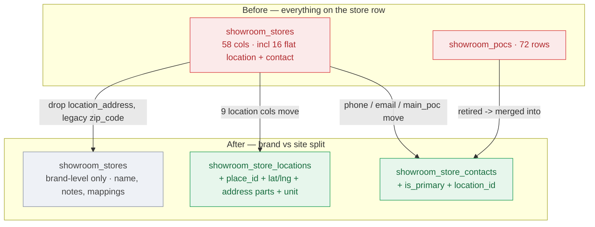
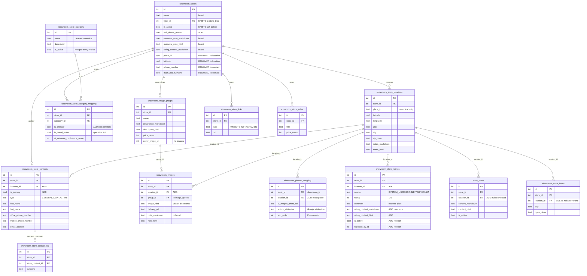
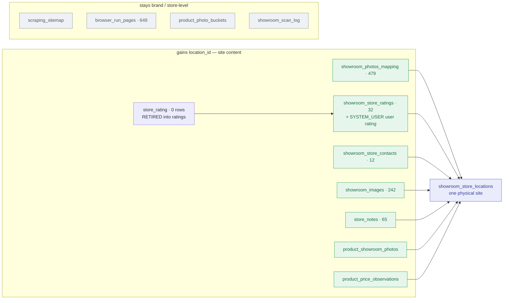

# Showroom Stores Schema Normalization — Migration Plan

**Slug:** `showroom-stores-normalization`
**Author:** audit 2026-08-09 (6-agent workflow `wf_e71374a2-377`), verified against prod (`main`)
**Status:** PLAN ONLY — no code changed. `readyToDrop = partial`.
**Goal:** finish moving the 16 flat location/contact columns off `showroom_stores` into
`showroom_store_locations` + `showroom_store_contacts`, then drop them — with zero data loss.

---

## 0. TL;DR — the premise correction

Moving location/contact data into child tables is **already half-done, not missing.**

- **Location data: 100% mirrored.** All 233 active stores already have ≥1
  `showroom_store_locations` row. The 16 flat columns are now **redundant parallel
  copies** (never cleared → they can drift from the primary location row).
- **Contact data: barely started.** `showroom_store_contacts` = 12 rows, **0
  GENERAL_CONTACT**. Legacy still holds 72 `showroom_pocs` + 5 flat `main_poc_*`.
- **The blocker is readers + writers, not schema.** Intake writes **zero** child rows;
  ~35 `placeId` sites + all geo/drive readers still read the flat columns via whole-row
  selects. A `DROP COLUMN` is a **silent `undefined` at the boundary** — no tsc/runtime error.

So this is a staged reader/writer migration (expand → contract), not an `ALTER TABLE`.

---

## 1. Hard facts (live prod, 2026-08-09)

All numbers computed from live prod pulls. Raw exports on disk:

| File | What | Endpoint / source |
|---|---|---|
| [`data/showroom-stores-list.json`](2026-08-09-showroom-stores-normalization/data/showroom-stores-list.json) | 233 active stores, full flat columns | `GET /api/showroom-stores?limit=500` |
| [`data/incomplete.json`](2026-08-09-showroom-stores-normalization/data/incomplete.json) | 164 stores w/ a completeness gap + `missing[]` | `GET /api/showroom-stores/meta/incomplete` |
| [`data/showroom-contacts.json`](2026-08-09-showroom-stores-normalization/data/showroom-contacts.json) | 12 contact rows | `GET /api/showroom-contacts` |
| [`data/from-pocs-dryrun-post.json`](2026-08-09-showroom-stores-normalization/data/from-pocs-dryrun-post.json) | backfill dry-run counts | `POST /api/showroom-contacts/backfill/from-pocs` (no `apply`) |
| [`data/summary.json`](2026-08-09-showroom-stores-normalization/data/summary.json) | computed rollup (below) | derived |

**Auth used (read-only):** `remodel_access = sha256(WORKER_API_KEY)` cookie (see
`scripts/config.mjs:63` `accessCookie()`); base = `https://core-remodel.hacolby.workers.dev`
(`scripts/config.mjs:32`). Key read via `node scripts/tokens.mjs WORKER_API_KEY`, never printed.

**Flat-column population across 233 active stores** (`summary.json → flatColumnPopulation`):

| Column | Populated | Null |
|---|---|---|
| `place_id` | 184 | 49 |
| `latitude` + `longitude` (both) | 184 | 49 |
| `location_address` | 207 | 26 |
| `location_city` / `_state` / `_street_number` / `_street_name` / `_zip_code` | 198 | 35 |
| `zip_code` (legacy) | 191 | 42 |
| `google_maps_link` | 185 | 48 |
| `phone_number` | 219 | 14 |
| `email_address` | 39 | 194 |
| `main_poc_fullname` | 5 | 228 |
| `main_poc_phone_number` | 5 | 228 |
| `main_poc_email_address` | 4 | 229 |

**Contacts (target) state:** 12 rows / 11 stores; types `{OTHER:10, MANAGER:2}`; **GENERAL_CONTACT = 0**.
**Legacy contact data awaiting migration:** 72 `showroom_pocs` + 5 flat `main_poc_*` stores
(`from-pocs` dry-run). GENERAL_CONTACT backfill from flat `phone_number` would create up to **219**
rows; from `email_address`, 39.

**Gaps still to close against remote D1** (not bulk-measurable via read APIs — SQL to run in Phase 0):
```sql
-- confirm no store has zero location rows (expect 0)
SELECT s.id FROM showroom_stores s
  LEFT JOIN showroom_store_locations l ON l.store_id = s.id
  WHERE s.is_active = 1 GROUP BY s.id HAVING count(l.id) = 0;
-- per-location place_id coverage
SELECT count(*) FILTER (WHERE place_id IS NOT NULL), count(*) FROM showroom_store_locations;
-- flat vs primary-location drift (address/zip/geo) — location wins on conflict
SELECT s.id FROM showroom_stores s JOIN showroom_store_locations l
  ON l.store_id = s.id AND l.is_primary = 1
  WHERE s.location_zip_code IS NOT NULL AND s.location_zip_code <> l.zip_code;
```

---

## 2. Column map (destinations + `is_primary` decision baked in)

`unit` note: `showroom_store_locations` **now has** a `unit` column
([`store_location.ts:58-67`](../../src/backend/db/schema/showroom/store_location.ts)) — the
`dedup_showroom_stores.ts` comment claiming "no suite/unit column" is **stale**. Recompose
address identity from structured parts incl `unit` before dropping `location_address`.

| Flat column (`showroom_stores`) | Destination | Notes |
|---|---|---|
| `location_street_number` | `showroom_store_locations.street_number` | move |
| `location_street_name` | `.street_name` | move |
| `location_city` | `.city` | move |
| `location_state` | `.state` | move |
| `location_zip_code` | `.zip_code` | canonical granular zip |
| `zip_code` (legacy) | **DROP** | redundant dup of `location_zip_code`; remove dual-writes first |
| `latitude` | `.latitude` (primary row) | move |
| `longitude` | `.longitude` (primary row) | move |
| `place_id` | `.place_id` (primary row) | dedupe unique index moves here |
| `google_maps_link` | `.google_maps_link` | move |
| `location_address` | **DROP** | derived via `formatShowroomAddress`, never stored |
| `phone_number` (store line) | `showroom_store_contacts.office_phone_number` on GENERAL_CONTACT | fields out |
| `email_address` (store) | `showroom_store_contacts.email_address` on GENERAL_CONTACT | fields out |
| `main_poc_fullname` | `.first_name` + `.last_name` on a PERSON row, **`is_primary = 1`** | name-split |
| `main_poc_phone_number` | `.office_phone_number` on that PERSON row | office (default) |
| `main_poc_email_address` | `.email_address` on that PERSON row | — |

**DECISION (yours):** add an **`is_primary` boolean** to `showroom_store_contacts` rather than
abusing the `type` enum. Migrated main POCs keep `type` = their real role (or `OTHER`) and carry
`is_primary = 1`. Additive migration:
```ts
// src/backend/db/schema/showroom/contacts.ts — add column + partial unique guard
isPrimary: integer("is_primary", { mode: "boolean" }).notNull().default(false),
// (t) => ({ ...existing indexes,
//   onePrimaryPerStore: uniqueIndex("ssc_one_primary_per_store")
//     .on(t.storeId).where(sql`is_primary = 1 AND is_draft = 0`),
//   oneGeneralPerStore: uniqueIndex("ssc_one_general_per_store")
//     .on(t.storeId).where(sql`type = 'GENERAL_CONTACT' AND is_draft = 0`),
// })
```
`showroom_store_contacts` already has `office_phone_number`, `mobile_phone_number`,
`email_address`, `is_draft`, `draft_notes` ([`contacts.ts:61-84`](../../src/backend/db/schema/showroom/contacts.ts)) — only `is_primary` + the two partial-unique indexes are new.

---

## 2.5 New feature folded in — intake normalization + sibling discovery (CHANGE-LIST PREVIEW, confirm before build)

Three intake behaviors requested. Below is how each maps to **our real code** — NOT the
Gemini snippet, which was written blind to this repo and gets our stack wrong (see the critique
table). Nothing here is built yet; confirm the shape first.

### 2.5.1 Force Camel/Title Case on the store name
- **New display normalizer** `toDisplayStoreName()` (Title Case) — separate from `normName()`
  ([`duplicate-signals.ts:156`](../../src/backend/services/showroom/duplicate-signals.ts)),
  which lowercases for MATCHING and must NOT change. Put it beside `normName`/`normHost`.
- **Preserve known casings:** KOHLER, THG Paris, McMy…, all-caps acronyms, brand punctuation.
  Title-casing "KOHLER" → "Kohler" is a regression. Use a small preserve-list + a "looks
  intentional" heuristic (existing mixed-case/all-caps tokens left alone).
- **Low-confidence → stage, don't mangle.** When the cased result is uncertain, keep the raw
  name and flag for review rather than hard-writing.
- **Applied at:** `_shared.ts persistPlaceShowroom`, `create_showroom.ts` manual path, and the
  Phase-1 backfill over the existing 233 names.

### 2.5.2 Root-domain dedup at intake → attach location, not new store
- Reuse **`normHost()`** ([`duplicate-signals.ts:96`](../../src/backend/services/showroom/duplicate-signals.ts)) — strips `www`, lowercases, already ignores generic hosts (squarespace/wix/facebook/linktr.ee…).
- Before insert: look up `showroom_store_links WHERE type='WEBSITE'` and `host = normHost(candidate.website)`.
  Match → route to the **Phase-2 attach-new-location path** under the existing parent store,
  not a new `showroom_stores` row.
- This is the **domain trigger** for the same "BUSINESS-signal match → attach location" behavior
  Phase 2 already defines for shared name/phone; it just adds website-root as a first-class signal.
- **Guard:** generic hosts must never fuse unrelated stores (the ignore-list already exists — use it).

### 2.5.3 50-mile sibling discovery via Google Places
- **Server discovers siblings — the client does NOT pass `siblingPlaceIds`.** After the root store
  is created/matched, query Google Places **Text Search** (`textQuery = <brand name>`,
  `locationRestriction` = 50-mile circle around the root lat/long) or Nearby rank-by-distance →
  candidate place_ids.
- For each candidate, in order:
  1. **Cross-table place_id guard** (the Phase-0 helper): skip if it already exists as a store OR a
     location row (`showroom_stores_place_id_uniq` + `showroom_store_locations_place_id_uniq`).
  2. **Website-host signal gate:** attach only if the candidate's website host `==` the parent's host.
     Name + proximity alone is the exact weak-signal false-merge class the dedup guards reject
     (`MAX_WEAK_FANOUT=2`, the 37-store incident) — a "Kohler Signature Store" and an unrelated
     "Kohler Plumbing Repair" 40 miles away must not fuse.
  3. **Insert a `showroom_store_locations` row** under the parent — **NO `isSibling` flag**
     (primary is DERIVED per #375). Enrich (hours, review summary) via our **existing** Places-details
     + `reviewAiInsight`/`reviewSummary` path, not a new OpenAI call.
- **Workflow:** extend `showroom-bulk-intake-workflow.ts` — one **short** `step.do()` per sibling for
  the Places fetch, and the AI summarize as its **own** short step (a ~90s inline Places+Gemini call
  in one step evicts the isolate and never checkpoints — known incident). Do NOT create a new
  `ShowroomIntakeWorkflow`.

### 2.5.4 Gemini's snippet vs our stack (do NOT implement verbatim)

| Gemini snippet | Our reality | Verdict |
|---|---|---|
| new `showroom_store` table, `text id` UUID PK, `place_id` unique | `showroom_stores` exists, **integer autoincrement** PK; place_id unique already present | reuse, don't recreate |
| new `showroom_store_locations` w/ `text id` + **`isSibling`** boolean | table exists (integer PK, structured street/`unit`/city/state/zip, lat/long, place_id-uniq, notes triple); #375 **derives** primary and explicitly rejects a stored primary/sibling flag | **drop `isSibling`**; reuse table |
| OpenAI SDK (`gpt-4o-mini`) via CF AI Gateway | repo AI = **Gemini-direct** (shared factory → `gemini_usage_log`) or Workers AI; **structured output w/ JSON schema mandatory**; review enrichment already exists (`reviewAiInsight`) | reuse existing enrichment; no new OpenAI path |
| new `ShowroomIntakeWorkflow` class | `showroom-bulk-intake-workflow.ts` + onboarding workflow exist; heavy AI in one `step.do` **evicts** | extend existing workflow; short steps |
| `for…of` with fetch **and** AI inline per `step.do` | ok to iterate, but split enrichment into its own short step | split steps |
| `migrate:db` script, `drizzle-kit generate`, `./drizzle` | ours: `pnpm run db:generate` → `pnpm run migrate:remote` (never `wrangler d1 execute --file`) | correct commands |
| Hono `/intake` route minting UUID store; client sends siblings | intake = `create_showroom.ts` + routes, integer ids; **server** discovers siblings via Places | wire into existing route |

---

## 3. Phased execution (expand → contract)

Nothing drops until Phases 2–4 are verified on prod. Every migration additive until Phase 5.

### Phase 0 — Guardrails + reconciliation (additive migration + a script)
- **Schema (additive):** add `is_primary` + the two partial-unique indexes above to
  `src/backend/db/schema/showroom/contacts.ts`. `pnpm run db:generate` → `pnpm run migrate:remote`.
- **Reconcile drift:** run the three SQL checks in §1 against remote D1; where flat vs primary-location
  differ, **location row wins**; log mismatches. Backfill any primary-location field from flat only
  where the location is null.
- **Cross-table `place_id` guard helper:** a shared fn that checks BOTH
  `showroom_stores_place_id_uniq` and `showroom_store_locations_place_id_uniq` — used by every
  intake insert in Phase 2 (so the migration window can't put a flat place_id that dupes a
  location-row place_id).
- **QC:** `scripts/qc/pr_<n>.mjs` asserting the new index rejects a 2nd GENERAL_CONTACT / 2nd primary.

### Phase 1 — Backfill contacts + verify (expand; location backfill already done)
- **Run the contacts backfill:** `POST /api/showroom-contacts/backfill/from-pocs?apply=true`
  (72 pocs + 5 flat `main_poc_*`). Backfill code: `src/backend/api/routes/showroom-contacts.ts:683-731`
  (main_poc read), `:448-458` (GENERAL_CONTACT backfill). Mint one GENERAL_CONTACT/store from flat
  `phone_number`/`email_address`; person rows from `main_poc_*` w/ `is_primary=1`.
  `db.batch`, chunk inserts at ~20 rows.
- **Verify counts:** GENERAL_CONTACT rows == stores w/ non-null flat phone/email (≤219/39);
  person rows reconcile against 72 pocs + 5 main_poc minus the 11 stores already carrying a contact
  (measure the overlap — unknown).
- **Location parity verify:** for each store, flat `place_id/lat/long/address parts` == the
  `is_primary` location row; fix mismatches BEFORE any reader repoint.
- Leave `showroom_pocs` in place (read-only) until Phase 4.

**Cleanup coverage for the §2.5 intake features (job #2 — backfill existing data to match new rules):**
- **Name casing backfill:** run `toDisplayStoreName()` over all 233 existing store names; write the
  Title-Cased result where confident, STAGE low-confidence for human review (never mangle brand casing).
  Export a before/after diff to `data/name-casing-diff.json` for approval before applying.
- **Domain consolidation pass:** group active stores by `normHost(website)`; where 2+ real
  (non-generic-host) stores share a domain and look like branches, they are exactly the existing
  **branch-collapse / merge-candidate** queue — 11 TBD candidates already staged
  (`list_merge_candidates`). Do NOT rebuild dedup; feed domain-derived groups into that queue for
  human approval, then `apply_merge_candidate` folds them into parent + location rows.
- **Optional, cost-gated:** one-time retroactive sibling discovery (Places 50mi + host gate) over
  single-location stores to surface missing branches INTO the merge-candidate queue (never auto-attach).
  Flag the Places-call cost; run behind an explicit `--apply` like every destructive sweep here.

### Phase 2 — Rewire WRITERS / intake (dual-write flat + child)
> Today intake writes **zero location/contact child rows** (it does write `showroom_store_hours` + `showroom_store_links`) → without this, any reader cutover orphans every new store's location/contact data.

Files to change (writers):
- `src/backend/mcp/tools/showrooms/_shared.ts:104-138` `persistPlaceShowroom` — INSERT the primary
  `showroom_store_locations` row + a GENERAL_CONTACT row alongside the store; keep flat writes (dual-write).
- `src/backend/mcp/tools/showrooms/_shared.ts:169-245` `adoptPlaceLocation` — convert from
  `update(showroomStores)` flat overwrite → **INSERT a new location row** (1:many) + a
  `primaryLocationStorePatch` dual-write (mirror `add_showroom_location.ts:136-147`).
- `src/backend/mcp/tools/showrooms/create_showroom.ts:231-256` (manual path) — same child inserts.
- `src/backend/services/showroom-bulk-intake-workflow.ts` + `intakeOnePlace` — inherit via `_shared.ts`.
- **place_id-new-location scenario:** in the intake dup path
  (`create_showroom.ts:177-208`, `_shared.ts:306-338`) when signals match a BUSINESS
  (shared website/name) but the `place_id` differs → **attach a new location row to the existing
  store** (route through `add_showroom_location.ts:132` insert, Places-enriched) instead of
  returning "exists" (discards site today) or minting a duplicate.
- `src/backend/services/showroom/duplicate-check.ts:82-92` `findDuplicateStore` — read
  `showroom_store_locations` (place_id/address/phone across ALL sites), not just flat columns.
- **Contacts write path:** fix `src/backend/mcp/tools/showrooms/add_showroom_poc.ts:56` (writes
  LEGACY `showroom_pocs`) → target `showroom_store_contacts`; intake "fields out" phone/email/fax
  into a GENERAL_CONTACT row.
- Apply the Phase-0 cross-table `place_id` guard in every intake insert
  (`_shared.ts:273-280`, `add_showroom_location.ts:106-123`).

### Phase 3 — Migrate READERS to child-table JOINs (ordered by blast radius)
Do NOT drop a column until its readers here are cut over AND verified on prod. `branch-collapse.ts:136`
already reads `showroomStoreLocations.placeId` — copy that JOIN pattern.

**3a. `placeId` FIRST (~35 sites, mostly WHERE predicates):**
`src/backend/services/showroom/duplicate-check.ts:86`, `dedup_showroom_stores.ts:155,193`,
`branch-detection.ts:59`, `places-backfill.ts:47,51,146`, `discovery-search.ts:434,436,729`,
`locations.ts:173,281,286,288`, `hitl-queue.ts:155`, `tesla/proximity-scan.ts:306,308`,
`showroom-contacts.ts:77`, `research-jobs.ts:724`, `showroom-stores.ts:1783,2698`,
`check_showroom_intake_status.ts:65`, `backfill_showroom_media.ts:148`, `create_showroom.ts:139`,
`bulk_import_showrooms_from_places.ts:73,75`, `showroom-backfill.ts:499,592,601,607`.

**3b. GEO second (`latitude`/`longitude` — live drive routing + Tesla nav):**
Repoint the single seam `src/backend/mcp/tools/showrooms/_shared.ts:41-58` `loadShowroomCoords`
(its docstring already calls it the migration seam) → then `whats_near_me.ts:176-180` follows.
Then: `src/backend/services/drive-lists.ts:129-141,274-296`,
`src/backend/api/routes/drive-lists.ts:108-109` (map markers),
`src/backend/services/drive-geo-match.ts:114-115` (auto-visited detection),
`src/backend/api/routes/tesla.ts:115-116,178-179`, `tesla/visit-sessions.ts:56-58`,
`tesla/send_vehicle_navigation.ts:56-57`, `tesla/send_drive_to_tesla.ts:68-69`.
**Requires** the canonical-location rule = the `is_primary` row (see §4).

**3c. CONTACTS third:** `src/backend/services/email/showroom-contact-autopopulate.ts:56`,
`src/backend/api/routes/showroom-contacts.ts:122,683-731`, `src/backend/api/routes/gmail.ts:808`
(threads-by-domain) — move flat `email_address`/`main_poc_*` LIKE-predicates + phonebook to a JOIN
on GENERAL_CONTACT/person rows.

**3d. ADDRESS-DERIVED last:** replace whole-row `store: showroomStores` selects in the LIST/DETAIL
routes (`src/backend/api/routes/showroom-stores.ts` ~`:1113` list, detail) with explicit JOINs
**re-aliased to the SAME output keys** (`latitude/longitude/locationAddress/phoneNumber/emailAddress/mainPoc*`)
so the frontend keeps working; compose `locationAddress` via `formatShowroomAddress`.
Also: `brands.ts:837`, `showroom-sales.ts:92`, `services/drive-lists.ts:278-282`, `mcp .../_shared.ts:48`.
Rewrite dedup address identity to compose from location street parts **incl `unit`**.

**Frontend pages/islands that consume these APIs — verify after each reader cutover (keys must stay identical):**

| Page (`.astro`) | Island (`.tsx`) | APIs it calls |
|---|---|---|
| `src/frontend/pages/admin/shopping/showrooms.astro`, `showrooms/[tab].astro` | `components/showroom/ShowroomsDirectoryApp.tsx` | `GET /api/showroom-stores` (list, flat), `/meta/place-exists`, `/api/tesla/navigate` (lat/long) |
| `src/frontend/pages/admin/shopping/store/[id].astro`, `store/[id]/[section].astro` | `components/showroom/StoreViewportApp.tsx` | `/api/showroom-stores/:id`, `/api/showroom-contacts`, `/api/showroom-sales/store/:id` |
| (edit modals in store viewport) | `components/showroom/EditStoreModal.tsx`, `components/showroom/hero/StoreEditModals.tsx` | `PATCH /api/showroom-stores/:id`, `/:id/address`, `/:id/hours`, `/:id/links` |
| `src/frontend/pages/admin/shopping/drives/index.astro`, `drives/[slug].astro` | `components/drives/DriveListsApp.tsx`, `DriveViewportApp.tsx`, `DriveRouteMap.tsx`, `DriveMapThumb.tsx` | drive-list APIs (consume store `lat/long` via coalesce) |

### Phase 4 — Deprecate: stop dual-writing + repoint indexes
- Remove flat-column writes from all Phase-2 writers (child tables become sole write target).
- Drop `showroom_stores_place_id_uniq`; `showroom_store_locations_place_id_uniq` becomes the single
  authority. Confirm no reader/writer still hits the stores index (gates the dedupe 409 path).
- Retire `showroom_pocs`: repoint `get_showroom` pocs[] (`showroom-stores.ts:3373-3382`) + `store-child-remap.ts`
  off `showroom_pocs`; confirm contacts is sole source.
- **Out-of-16 stranded fields** — decide in THIS cutover, not later: `bay_area_city_id`,
  `hub_route`/`hub_name`, `distance_from_sf_time`/`_miles` live flat on stores; locations DERIVES
  hub + distance. Confirm read-from-join or drop deliberately.

### Phase 5 — DROP (separate migration, after prod verified)
- Drop the 16 columns (+ retired `showroom_pocs`, + stranded fields) via **backup → rebuild → restore**,
  NOT a naive drizzle column drop: `DROP COLUMN` rebuilds `showroom_stores` while **~24 cascade-FK child
  tables** (verified — NOT just 4: browser_run_pages, categories, hours, image_groups, merge_exclusions,
  product_areas, product_mappings, research, both ratings tables, sale_items, similar_maps, showroom_images,
  visit_log, tags, locations, contacts, links, pocs, …) hang off it and can be silently wiped.
  `PRAGMA foreign_keys=OFF` is a no-op in wrangler. **The Phase-5 backup checklist MUST enumerate every
  cascade child, not the 4 obvious ones** — this is the real data-loss vector (cross-provider review, verified).
- Keep additive-safe until this lands (previews share prod D1). `pnpm run migrate:remote`; verify columns
  gone AND every child row count unchanged before/after.
- Post-drop QC (behavioral, not "build passed"): directory map markers, drive pitstops/routing, Tesla
  nav, dedup match rate, contacts phonebook, Gmail domain-match — all GREEN.

---

## 4. Open decisions

| # | Decision | Recommendation |
|---|---|---|
| 1 | main POC contact type | **RESOLVED: add `is_primary` flag** (yours). `type` keeps real role or `OTHER`. |
| 2 | canonical location row for geo (1:many → geo readers assume 1) | **RESOLVED by PR #375:** primary is **DERIVED, not stored** — the location whose `place_id` matches the parent store, else the lowest id (`services/showroom/locations.ts:14-15,121-132`). A stored flag "would drift." Geo readers pick that row. NOTE the tension: the derivation keys off `showroom_stores.place_id`, so Phase 4 (retiring the flat place_id) must swap the rule to key off the primary **location** row. |
| 7 | store name casing at intake | **Title/Camel Case** via a NEW display normalizer, distinct from `normName()` (which lowercases for MATCHING only). Preserve known brand casings (KOHLER, THG Paris, McX, acronyms); STAGE low-confidence rather than mangle. |
| 3 | workers-ai fuzzy intake match | **NO** — signal grouping + `MAX_WEAK_FANOUT=2` guard already prevents the 37-store false-merge class; real gap is relational (new-site home), not matching precision. |
| 4 | `main_poc_phone_number` office vs mobile | office (default) — only 5 stores affected. |
| 5 | name-split for `main_poc_fullname` | split on last space; STAGE (`is_draft=1`+`draft_notes`) when confidence low (mononyms / "Front Desk"). |
| 6 | legacy `zip_code` drop | confirm `location_zip_code` canonical; reconcile drift (location wins); remove dual-writes at `showroom-stores.ts:2290`, `showroom-backfill.ts:639`, `set_showroom_address.ts:35`. |

---

## 5. D1 cautions (non-negotiable)

- **No `db.transaction()` / `BEGIN`** — D1 rejects it (error 7500). Every backfill = `db.batch([...])`.
  Insert-then-link (store → location → contact) can't share generated ids in one batch → write
  sequentially with a compensating delete on failure; comment the residual gap.
- **`DROP COLUMN` rebuilds the table** while **~24 cascade-FK child tables** reference it → silent child-wipe (plan originally said 4 — undercount caught by the cross-provider review; verified ~24 via grep).
  Backup → rebuild → restore, separate migration, after prod verified.
- **100 bound-param cap** — chunk backfill inserts/`inArray` at ~20 rows, then batch each chunk.
- **Silent-null hazard, not crash** — geo/dedup/directory read via whole-row `store: showroomStores`
  selects + `coalesce()`/`leftJoin`; a dropped column yields `undefined` with no tsc/runtime error.
  Verify by behavior/QC.
- **Previews share prod D1** — keep every migration additive until the final DROP; `pnpm run migrate:remote`
  only (never `wrangler d1 execute --file`); verify row counts before/after.
- **Stale-comment trap** — `dedup_showroom_stores.ts` says locations has "no suite/unit column"; it now
  DOES (`unit`). Rewire dedup to use `unit` before trusting the child table for address identity.
- **Places search returns same-name-different-company noise** — sibling discovery (§2.5.3) MUST gate
  every candidate on a website-host signal match before attaching. Never auto-attach on name +
  proximity alone; that is the weak-signal false-merge class (`MAX_WEAK_FANOUT=2`, the 37-store incident).
- **`isPrimary` is DERIVED (PR #375), never stored** — do NOT add an `is_primary`/`isSibling` column to
  `showroom_store_locations`. The derivation keys off `showroom_stores.place_id`, so Phase 4 (retiring
  the flat place_id) must move the rule onto the location rows or every store loses its primary marker.

---

## 6. What was run to produce this (reproducibility)

- 6-agent audit workflow `wf_e71374a2-377` (schema-readiness, backend blast-radius, frontend
  blast-radius, intake-readiness, live-data, synthesis). Transcript under the session `subagents/workflows/` dir.
- Live pulls → `data/*.json` (see §1 table). Auth: `accessCookie()` = `sha256(WORKER_API_KEY)`.
- `dedup_showroom_stores` dry-run is DESTRUCTIVE-annotated → classifier-gated for the agent; run it
  yourself for the Tier-1 same-site duplicate map. `list_merge_candidates` (Tier-2 branch queue) is
  read-only and returned 11 TBD candidates.
- **PR #375 (merged 2026-08-09, after the audit) shipped multi-location on the viewport + directory:**
  `services/showroom/locations.ts` (derived `isPrimary`), `showroom-stores.ts` (+75), and the frontend
  receivers `components/showroom/locations/LocationsModal.tsx` + `ShowroomMergedCard.tsx`. So Phase 3d's
  location-aware frontend is **partly already built** — the reader migration should extend #375's DTO,
  not invent a new one. Plan re-verified against `origin/main` including #375.

---

## 7. Content re-parents to a LOCATION (the new requirement) — Phase "L"

**Requirement:** photos, reviews, notes, visits, contacts must attach to a physical
`showroom_store_location`, not the brand-level store — so a multi-location brand (Porcelanosa
across the Bay) shows content per site with a source badge.

**Before/after + ER diagrams render in-app (mermaid) on the changelog detail page:**
https://core-remodel.hacolby.workers.dev/admin/changelog/showroom-stores-normalization — and inline below.

### Before / after — the store row splits (red = removed, green = added)


### Entity model after normalization


### Content re-parents to a location


**Full DB archive / restore point** (git-ignored, local only):
`docs/plans/2026-08-09-showroom-stores-normalization/db-archive/` — `full-dump-20260810.sql` (57 MB,
whole prod DB via `wrangler d1 export`) + `json/*.json` (25 showroom-cluster tables). Restore any table from these.

**Model:** uniform + additive. Each site-specific table gets a **nullable `location_id integer
references showroom_store_locations(id)` + index**, keeps its `store_id`/`showroom_id` anchor, and is
backfilled to the store's DERIVED primary location (trivially correct — 232/233 stores are
single-location today). No hard move, no table rebuild until the Phase-5 flat drop.

| Table | Decision | Delete rule | Backfill key |
|---|---|---|---|
| `showroom_visit_log` | **LEFT ALONE this phase** (drive-list owned, unpopulated) — revisit with the drive work | — | — |
| `showroom_photos_mapping` (479) | +`location_id` | CASCADE | **exact place_id** (scraped per place) |
| `showroom_store_ratings` (32) | +`location_id`, +`source=SYSTEM_USER`, +`is_active`/`replaced_by_id` (revision), +`rating_context_markdown`/`rating_context_html` (user note) | CASCADE (external) / SET NULL (user) | **exact place_id** (external), primary (user) |
| `store_rating` (0 rows) | **RETIRED** → folds into `showroom_store_ratings` as `source=SYSTEM_USER` | — | n/a |
| `showroom_store_contacts` (12) | +`location_id` (POC target) | SET NULL | primary |
| `showroom_images` (242) | +`location_id` | SET NULL | primary |
| `store_notes` (65) | +`location_id` (null = brand note) | SET NULL | primary |
| `product_showroom_photos` | +`location_id` (only if showroomId set) | SET NULL | primary |
| `product_price_observations` | +`location_id` (sourceType='showroom') | SET NULL | primary |
| `scraping_sitemap`, `browser_run_pages` (649), `product_photo_buckets`, `showroom_scan_log` | **STAY store-scoped** (brand website / RAG corpus / product-intake / audit) | — | — |

⚠️ **Sharp edge (review DIM-5):** `store-child-remap.ts` keys all 27 child tables on the store FK. Once
content carries `location_id`, a store merge that repoints `store_id` but not `location_id` **orphans
per-site content** — the merge path MUST also remap `location_id` (or fold loser locations into the
keeper first). Hard gate, not a footnote.

✅ **Precedent to copy — `showroom_store_hours` already did this** (cross-provider review, verified):
`hours.ts:48` already carries a nullable `location_id` FK → `showroom_store_locations` with the exact
brand-wide-when-null / per-site-when-set semantics Phase L proposes, plus a compound unique index
(`hours.ts:80-84`), shipped under plan 0031. **The Phase-L pattern is proven, not invented** — mirror `hours`.
And the remap gap is **already live**: `store-child-remap.ts:97` moves hours by (`showroomId`, `day`) but
**ignores `location_id`**, so a merge today can already mis-associate per-site hours. → **Pull the
`location_id`-aware remap fix into Phase 0** (it fixes hours now), don't defer it to Phase L.

⚠️ **Cross-plan collision:** the Phase-0 partial-unique guards (`one GENERAL_CONTACT`, `one is_primary`
per store) must become **per-LOCATION** in the SAME migration that adds `contacts.location_id`, or a
3-site brand can hold only one front-desk line.

---

## 8. API-layer walkthrough (#3)

**Full endpoint-by-endpoint walkthrough (every route, current→new, file:line, phase, breaking?, frontend
consumer):** [2026-08-09-showroom-stores-api-walkthrough.md](2026-08-09-showroom-stores-api-walkthrough.md)

🔴 **Breaking gap that exists TODAY (found during the audit):** `GET /api/showroom-stores/meta/place-exists`
(`showroom-stores.ts:2761`, reads flat `placeId` only at `:2772`) already misses location-only place_ids —
the dedup 409 path can mint a duplicate for a place that lives only on a location row. Fix with
`loadPlaceIdOwners` in Phase 2.

Load-bearing change:

- **`GET /api/showroom-stores` (list)** — today returns flat `latitude/longitude` + `locationCount` +
  `locationCities[]` (names only), **no coordinates per site** (`showroom-stores.ts` ~:1301-1347). NEW:
  add `locations[]{id,city,latitude,longitude,isPrimary,placeId}` (data already exists via
  `loadStoreLocations`, already returned by `/:id/locations`). This is the single change that unblocks
  the directory map. Keep flat lat/lng for back-compat.
- **`GET /api/showroom-stores/:id` (detail)** — swap whole-row `store: showroomStores` for JOINs
  re-aliased to identical keys; add per-location content.
- **Writers** (`/:id/photos`, `/:id/notes`, `/:id/pocs`, `/:id/rate`, visit) — accept + **validate a
  `location_id` that belongs to the store**; reject a mismatched one.
- Contacts, drive-lists (coords → location), tesla nav, gmail domain-match, brands, sales — per §3.

---

## 9. Frontend walkthrough (#4)

### 9.1 Showroom directory — one marker PER LOCATION
- **Bug:** `ShowroomsDirectoryApp.tsx` MapView plots one marker per store from flat
  `store.latitude/longitude` (`ShowroomMarker` @888, filter @996, viewport @1076, map @1112). A Bay-wide
  brand shows a **single pin**; sibling sites vanish.
- **Fix:** consume the new list `locations[]`, `stores.flatMap(s => s.locations.map(loc => ({store:s, loc})))`,
  one marker per site (popup: store name + site city + "site 2 of 3", still deep-links to the per-store
  viewport). Gated on the §8 API shape change.
- **Cards need no change** — `ShowroomMergedCard.tsx` already shows "{n} locations" + city chips (@372-396).
  Ratings here **coalesce** to one brand number.

### 9.2 Showroom viewport — one page, per-location source badges
- **Location switcher** above the bento (`StoreViewportApp.tsx` @1396) when `locationCount ≥ 2`:
  segmented `All sites | SF | San Jose | …`, `activeLocationId` state (null = brand). Single-location
  stores (232/233) hide it — zero change. Reuses the `/:id/locations` payload `LocationsModal` already fetches.
- **Per-section badges** — each content section carries a site badge from `location_id`:
  - **Contacts** (@2234) grouped by site; null → "Brand / all sites". `RecordVisitModal` (@359) sends `locationId`.
  - **Photos** (@2547) — Places gallery (per exact place) + visit uploads both badged. `UploadPhotoModal`
    gains a **location selector** (default = active site); POST `/:id/photos` (@952) adds `locationId`.
  - **Notes** (@2363) — badge when set; null renders brand-level. Editor persists `activeLocationId`.
  - **Ratings / Visits** — hero + external ratings badged per site; visit_log stamps `location_id` at write.
- **LocationsModal** (@189-197) currently fuzzy-matches contacts by city string → replace with exact
  `location_id` filter once contacts carry it.

### 9.3 Drives
- Stop coords / geo-match / stop-rating coalesce to the flat store row (`drive-lists.ts` @108-109,
  `drive-geo-match.ts` @113-114, rating write @552-559). NEW: resolve to the stop's specific **location**
  and stamp `location_id` on the recorded visit — turns today's derived canonical site into a recorded one.

---

## 10. Agentic review plan (#5a)

8 dimensions, each owned by an agent; every finding must be **CONFIRMED with a reproducible scenario or
REFUTED with a cited line** by an independent red-team agent before it counts:

1. **Schema correctness** — migration additive-only through Phase 4; NO `is_primary`/`isSibling` on locations (derived per #375); `location_id` FKs nullable alongside the kept store FK.
2. **FK & backfill integrity** — every backfilled `location_id` resolves to a location whose `store_id` matches (no cross-store leakage); single-location stores get zero orphans; contacts counts reconcile (72 pocs + 5 main_poc − 11 overlap).
3. **Silent-null reader coverage** — line-referenced checklist of all ~35 placeId + geo + contact readers, each migrated or justified.
4. **Content→location retarget** — exactly the per-site tables carry `location_id`; brand-level untouched; writers set BOTH ids.
5. **Merge/remap safety** — `remapStoreChildren` also remaps `location_id`; sibling attach requires a host match; false-merge guards (`MAX_WEAK_FANOUT`) intact.
6. **D1 safety** — no `db.transaction`; batch+chunk@20; Phase-5 DROP is backup→rebuild→restore.
7. **Frontend contract parity** — JOIN responses re-alias to identical keys; per-site content renders; single-location unchanged.
8. **Intake normalization** — `toDisplayStoreName` ≠ `normName`; domain/sibling gated on host; workflow steps short.

**Merge gates** — Phase 0→1 (guardrails green), 1→2 (backfill+parity), 2→3 (writers dual-write), 3→4
(readers cutover + DTO parity), 4→5 (deprecate + repoint index), 5 (DROP invariant + behavioral sweep).

---

## 11. Full smoke-test plan (#5b)

- **Harness:** one `scripts/qc/pr_<n>.mjs` per phase, reusing `scripts/config.mjs` (`createClient`/`createChecks`/`accessCookie`). Run `pnpm run test:pr <n> -- --preview` (branch, hard-assert) **and** `pnpm run test:pr <n>` (prod regression). ⚠️ **There is NO `pnpm run smoke` on `main`** (memory was stale) — the read sweep is `pnpm run test:pr --all`.
- **Every check is BEHAVIORAL** (compares a value/count), never HTTP 200 — a dropped column is a silent `undefined`.
- **Per phase (34 checks total):**
  - **P0** — partial-unique rejects a 2nd GENERAL_CONTACT / 2nd primary; additive migration doesn't break existing reads; flat-vs-primary drift baseline.
  - **P1** — GENERAL_CONTACT count == stores w/ flat phone/email; phonebook non-empty; name-casing preserves brand casing; location parity == 0 divergent.
  - **P2** — intake writes a primary location row; website-root match attaches a location (store count unchanged); `add_showroom_poc` writes contacts; cross-table place_id guard; dedup vector unchanged.
  - **P3a-d** — placeId meta/place-exists vector identical; drive marker + stop-coord counts == prod; Tesla nav coords non-null; whats_near_me set == prod; Gmail domain-match counts; **list/detail value-diff** (keys + values identical after JOIN cutover).
  - **PL** — 0 null `location_id` after backfill; child row counts unchanged (additive); photo/note/rating/visit created with `locationId=siteB` returns only under siteB; brand content stays store-level; Porcelanosa renders per-site.
  - **P4** — PATCH address updates primary location; place_id authority moved to location index; pocs retired (sourced from contacts).
  - **P5** — **child row count byte-identical pre/post the DROP** (cascade-wipe guard); columns gone yet keys/values identical; full green sweep; every store keeps exactly one derived primary after flat place_id retires.

---

## 12. Success criteria (#5)

- Directory map shows **N pins for an N-location brand** (Porcelanosa), not 1; total markers == Σ locations-with-coords.
- List response carries `locations[]` with exactly one `isPrimary` per store.
- After backfill, **0 null `location_id`** in every location-scoped table for single-location stores.
- **Child row counts byte-identical pre/post every migration**, especially across the Phase-5 DROP.
- Dedup `meta/place-exists` vector identical preview vs prod; a location-only place_id is deduped.
- Every per-site content item carries a **source badge** on multi-location stores; single-location stores unchanged.
- Contacts backfill counts reconcile; per-location partial-unique rejects duplicates.
- Tesla nav + drive markers + whats_near_me resolve to the location, values == prod.
- List/detail output keys+values unchanged after JOIN cutover (no silent null).
- A `locationId=siteB` write returns only under siteB; brand mappings/category/overview stay store-level.
- A multi-location store **merge preserves every per-site mapping** (no orphaned `location_id`).
- Full smoke green on **preview AND prod**, and green on prod again after the manual Deploy.

---

## 13. Open decisions (updated)

1. ~~`store_rating` vs `showroom_visit_log.rating`~~ **RESOLVED:** the user's own rating lives in `showroom_store_ratings` with `source='SYSTEM_USER'`, per location, revisable (`is_active`/`replaced_by_id`), with a rich note (`rating_context_markdown`/`rating_context_html`). `store_rating` (0 rows) is retired and folds in. **`showroom_visit_log` is LEFT ALONE this phase** (drive-list owned, unpopulated). Flat `showroom_stores.rating` + `rating_context_*` backfill into a SYSTEM_USER row at the primary location, then drop. Writers: `POST /:id/rate` writes a SYSTEM_USER row instead of `store_rating`.
2. Contacts partial-unique scope → **per-location**, must land in the same migration as `contacts.location_id`.
3. Re-key the derived-primary rule onto the **location** row BEFORE Phase 4 retires the flat `place_id` (circular dep).
4. Where Phase L sits vs the 5 phases + the `store-child-remap` location_id remap contract.
5. Delete semantics: SET NULL (precious content) vs CASCADE (photos_mapping/ratings) — confirm CASCADE.
6. Confirm null `location_id` renders as brand-level everywhere.
7. Writer coverage: switcher default (active site vs primary); every create path stamps `location_id`.

---

## 14. Location-aware contacts, manual add-location, and business-card intake

Diagrams (render on the changelog page):
- **Consolidation** of the 11 duplicate-store groups → one brand + N locations.
- **Intake sibling auto-discovery** flow.
- **Business-card → POC** flow.

### 14.1 The business-card "location doesn't match" bug (root cause)
When you upload business cards in the iOS model chat and ask it to create POCs, `create_showroom_contact`
([`api/routes/mcp/tools/create_showroom_contact.ts`](../../src/backend/api/routes/mcp/tools/create_showroom_contact.ts))
matches a **brand** by `placeId`/`website`/`phone`/`name` — but it has **no location dimension**. So when a
card's address is a *different branch* than the one matched store, the model sees the addresses disagree,
can't tell the brand has several sites (there's no per-location contact model yet), and stalls with
"the contact's location doesn't match the showroom location." Nothing is broken in the data — the tool is
just location-blind. The fix is the contacts `location_id` retarget plus three tool changes:

1. **Return all locations for the matched brand.** On a brand match, `create_showroom_contact` /
   `resolve_business_card` return the brand's `locations[]` (id, address, city, isPrimary) so the model can
   see every site instead of comparing against one.
2. **Attach the contact to a `location_id`.** The contact write accepts `locationId` and stamps it
   (`showroom_store_contacts.location_id`, per Phase L). Per-location GENERAL_CONTACT (each site its own front-desk line).
3. **Create the location + the contact together when the site is new but the brand exists.** If the card's
   address does not match any known location AND the brand is matched, the tool creates a new
   `showroom_store_locations` row (via the same path as `add_showroom_location`) **and** attaches the contact
   to it, in one call. The model never has to make two calls or resolve the address itself.

`add_showroom_poc` ([`mcp/tools/showrooms/add_showroom_poc.ts`](../../src/backend/mcp/tools/showrooms/add_showroom_poc.ts))
gets the same `locationId` param and is repointed off the legacy `showroom_pocs` table onto
`showroom_store_contacts` (Phase 4).

### 14.2 Manual add-location — MCP tool exists, REST endpoint is the gap
- **MCP: already shipped.** `add_showroom_location`
  ([`mcp/tools/showrooms/add_showroom_location.ts`](../../src/backend/mcp/tools/showrooms/add_showroom_location.ts))
  is the correct tool for "a store I already know, at an address it isn't recorded at" — structured address
  parts, optional `placeId`, and it **fails if the `placeId` is already held by another site**. No change
  needed beyond the cross-table `place_id` guard (Phase 0) and returning the new `location_id`.
- **REST: NEW — `POST /api/showroom-stores/:id/locations`.** Only `GET /:id/locations` exists today
  ([`showroom-stores.ts:1611`](../../src/backend/api/routes/showroom-stores.ts)); there is no write endpoint,
  so the UI has to go through `update_showroom` (which OVERWRITES the primary) — wrong. Add a POST that
  inserts a location row (same validation as the MCP tool: structured parts, cross-table place_id guard,
  reject a `placeId` owned elsewhere) and returns the row incl derived `isPrimary`. The LocationsModal
  "add site" button wires to this.

### 14.3 Intake sibling auto-discovery (the "check for other locations" plan)
Already specified in **§2.5.3** — restated as the flow diagram on the changelog page:
1. New intake → if `normHost(website)` matches an existing store, **attach as a new location** under that
   parent instead of creating a duplicate store.
2. Then a **Google Places Text Search** (brand name, 50-mile radius around the root) finds sibling sites.
3. For each candidate: skip if its `place_id` is already registered (**stores OR locations** — the
   cross-table guard); otherwise attach it as a new `showroom_store_locations` row **only if its website
   host matches the parent** (host gate — name+proximity alone is the false-merge class). Enrich via the
   existing Places-details path.

---

## 15. Rich-text column naming convention

**The suffix is already uniform** — every PlateJS field in the schema is a `<purpose>_markdown` +
`<purpose>_html` pair (verified across the showroom schema: `content_*`, `note_*`, `notes_*`,
`overview_note_*`, `rating_context_*`, `description_*`, `summary_*`, `deal_insight_*`, `damage_notes_*`,
`reason_*`). The **prefix names the field's meaning** and legitimately differs per table — a store's
brand `overview_note` is not a note-timeline `content` is not a rating's `rating_context`.

**Convention (documented, matches CLAUDE.md):**
- Every user-authored rich-text field stores **both** `<purpose>_markdown` (source of truth) **and**
  `<purpose>_html` (render cache) — never one without the other.
- `<purpose>` = what the field *is*, not the table it's on.

**Standardization applied here:** the per-location user-rating note in `showroom_store_ratings` uses
**`rating_context_markdown` / `rating_context_html`** — the SAME name the store already uses
(`showroom_stores.rating_context_*`) — not a new `comment_*`. External review text stays plain `comment`.

**No live column renames** are proposed: renaming an existing column on D1 forces a full table rebuild
(the same cascade-wipe hazard as the Phase-5 drop) for zero behavioral gain, since the pairs already
conform. If you want literal prefix-uniformity across tables, that is a separate, deliberate rebuild
migration — flag it and it gets its own phase.

---

## 16. `showroom_stores` field additions + confirmations (round 2 review)

- **`is_active`** — ALREADY EXISTS ([stores.ts:145](../../src/backend/db/schema/showroom/stores.ts)). No work.
- **`type_id` FK → `showroom_store_type`** — ALREADY EXISTS ([stores.ts:41](../../src/backend/db/schema/showroom/stores.ts)). No work.
- **`soft_delete_reason` TEXT — NEW** (nullable). Additive column; written when `is_active` is set false. Surface it in the admin viewport + the deactivate action. API: `PATCH /:id` accepts it; MCP `delete_showroom`/`update_showroom` accept it.

**Child-table confirmations** (all store-scoped, all remapped on merge by `store-child-remap.ts`):
`showroom_store_links`, `showroom_store_hours` (already has `location_id`), `showroom_store_sales`,
`showroom_store_contact_log`, `store_notes`, `showroom_image_groups`. `showroom_photos_mapping` = Google
Places photos (per place); `showroom_images` = user uploads (device / Google Photos) + web-scrape logo/
storefront (`image_kind`); `showroom_image_groups` = user-made photo stacks on the viewport.

---

## 17. Category cleanup + primary-category directory grouping

**Problem (verified on live prod — 70 categories):**
1. **~21 exact 0-store duplicates** — intake minted a second full copy of the vocab (ids **50–70** duplicate
   34–49: two "Flooring", two "Windows & Doors", two "Countertops", etc.). The AI classifier "add a category
   if missing" behavior did this.
2. **Suffix noise** — "Tile & Surfaces **Showrooms**", "Windows & Doors **Dealerships**", "Slab & Natural Stone
   **Yards**", "Lighting **Showrooms**", "Appliance **Galleries**".
3. **Near-dupes** — Closets: #5/#35/#36 (+dupes); Kitchen: #4/#39/#40/#41 (+dupes); Tile: #2/#34; Plumbing/Bath:
   #3/#31/#32/#33/#13; Windows/Doors: #9/#30/#37; Flooring: #29/#7; Lighting: #8/#43.
4. **Directory "primary" is arbitrary** — the viewport groups a store under **its first-registered category
   mapping** ([showroom-stores.ts:1189](../../src/backend/api/routes/showroom-stores.ts): *"the first category
   is the store's primary type"*), so a store with 5 categories appears in whichever was inserted first, and
   can surface in multiple groups. There is **no `is_primary` flag**.

### 17.A ADOPTED — Gemini 28-category canonical (survivor ids kept, dupes merged in)

**Backup taken** before any change: `db-archive/category-backup-20260812/{showroom_store_category,
showroom_store_category_mapping}.json` (70 + 225 rows, git-ignored). Restore point secured.

Survivor = the existing low id, **renamed + given an AI-optimized description**; every dupe/near-dupe
remaps into it. 28 canonical categories kept (granular trades stay distinct — Glass, Concrete, Fireplaces,
etc. are their own category, not swept into a bucket).

| id | Canonical name | Merge these ids in |
|---|---|---|
| 1 | Stone & Countertops | 46, 67 |
| 2 | Tile | 34, 55 |
| 3 | Bath & Plumbing | 31, 32, 33, 52, 53, 54 |
| 4 | Cabinetry | 39, 40, 41, 60, 61, 62 |
| 5 | Closets & Storage | 35, 36, 56, 57 |
| 6 | Appliances | 45, 66 |
| 7 | Flooring | 29, 50 |
| 8 | Lighting | 43, 64 |
| 9 | Windows & Doors | 30, 37, 51, 58 |
| 10 | Hardware | — |
| 11 | Paint & Coatings | 42, 63 |
| 12 | Architectural Concrete | 38, 59 |
| 13 | Glass | 28 |
| 14 | Home Automation | — |
| 15 | Outdoor & Landscaping | 44, 48, 65, 69 |
| 16 | Roofing & Exteriors | — |
| 17 | Electrical & HVAC | — |
| 18 | Home Decor & Furniture | — |
| 19 | General Home Improvement | — |
| 20 | Building Materials & Millwork | 47, 68 |
| 21 | Pools & Spas | — |
| 22 | Fireplaces | — |
| 23 | Elevators & Lifts | — |
| 24 | Acoustics & Soundproofing | — |
| 25 | Metalwork & Fabrication | — |
| 26 | Stairs & Railings | — |
| 27 | Window Treatments | — |
| 49 | Water Filtration | 70 |

Prod ids 1–27 + 49 already line up with these trades by id, so this is: **rename survivors → remap dupes →
dedup → deactivate the 42 merged-away ids.**

**Mechanics — D1-safe, and repo-rule-correct (NOT Gemini's raw `DELETE`):**
1. **Rename + describe survivors** — `UPDATE showroom_store_category SET name=…, description=…` for the 28
   ids (Gemini's names/descriptions verbatim). Pure updates, no risk.
2. **Remap mappings with dedup** — the `(store_id, category_id)` unique index makes a plain UPDATE throw
   when a store already has the survivor category. Use **`UPDATE OR IGNORE showroom_store_category_mapping
   SET category_id=<survivor> WHERE category_id IN (<dupes>)`** — collisions are left on the old id — then
   **`DELETE FROM showroom_store_category_mapping WHERE category_id IN (<all 42 merged-away ids>)`** to drop
   the leftover dupes. (Mapping rows are per-store data, not a definition, so deleting a redundant mapping is
   fine — deleting the *category definition* is not.)
3. **Soft-deactivate, do NOT hard-delete the definitions** — `UPDATE showroom_store_category SET is_active=0
   WHERE id IN (<42 merged-away ids>)`. Repo rule: never hard-delete a definition (soft-delete via `is_active`).
   Gemini's `DELETE FROM showroom_store_categories …` **violates that** — we deactivate instead; the backup +
   the kept rows mean it's fully reversible, and a hard purge can be a later, separate, verified step if ever wanted.
4. Apply via `pnpm run migrate:remote` (a data migration file) — never `wrangler d1 execute --file`. Category
   id list is small (~42), so no chunking needed; no `db.transaction` (D1 forbids it).

### 17.A-legacy (superseded — my earlier 17-bucket flatten)
Kept for the record; the Gemini 28-category set above is what we build.

<details><summary>old 17-bucket map</summary>
Every one of the 70 live categories is assigned. `[N]` = stores currently mapped. `0-store` ids are the
duplicate/never-used rows intake minted — remap is a no-op, just deactivate them.

| Canonical | [stores] | Folds in (old category ids) |
|---|---|---|
| Home Decor, Furniture & Textiles | 58 | 18 |
| Bath, Plumbing & Shower | 30 | 3, 32, 31, 33, 13 (Glass & Shower); +52, 53, 54 (0-store) |
| Countertops & Stone ⚠️ | 25 | 46, 1 (Slab & Natural Stone); +67 |
| Tile & Surfaces | 22 | 34, 2 (−"Showrooms"); +55 |
| General Home Improvement | 12 | 19 |
| Lumber, Millwork & Building Materials ⚠️ | 10 | 20, 26 (Staircases), 47 (Trim); +68 |
| Flooring | 10 | 29, 7 (Hardwood); +50 |
| Landscape & Outdoor | 9 | 15, 48, 44 (Decking); +65, 69 |
| Windows & Doors | 8 | 9 (−"Dealerships"), 30; +37 (Frameless), 51, 58 |
| Paint & Coatings | 8 | 11, 42 (Microcement); +63 |
| Kitchen & Cabinetry | 8 | 4, 39; +40, 41 (InvisaCook/PITT), 60, 61, 62 (0-store) |
| Hardware & Architectural Fittings | 5 | 10 |
| Lighting | 5 | 8 (−"Showrooms"), 43 (Architectural); +64 |
| Closets & Storage | 4 | 5; +35, 36, 56, 57 (0-store) |
| Electrical & Mechanical Supply | 4 | 17 |
| Appliances ⚠️ (standalone, not folded into Kitchen) | 4 | 6 (−"Galleries"), 45; +66 |
| Specialty & Structural ⚠️ (bucket) | 3 | 16 Roofing, 25 Metalwork, 38 Precast; +12, 14 (Home A/V), 21 (Pool/Spa), 22 (Fireplaces), 23 (Elevators), 24 (Acoustic), 27 (Window Treatments), 28 (Smart Film), 49/70 (Water Filtration), 59 (0-store) |

⚠️ **Defaults I chose — override any:** Appliances standalone (not in Kitchen); Countertops+Slab merged;
Glass&Shower→Bath; Staircases+Trim→Millwork; the 0-store long tail (Pool, Fireplace, Elevators, Acoustic,
Window Treatments, Smart Film, Water Filtration, Home A/V) swept into Specialty — split any out if you stock it.

**Mechanics (additive → remap → deactivate, D1-safe):**
- Pick/create the canonical rows; write a `merge_map` (old category_id → canonical id).
- Remap `showroom_store_category_mapping` to canonical ids in `db.batch` chunks of 20; the
  `(store_id, category_id)` unique index dedups collisions (drop the loser mapping).
- **Soft-deactivate** the merged-away + 0-store category rows (`is_active = false`) — never hard-delete a
  definition (repo rule).
</details>

### 17.B Add `is_primary` to the mapping
- **New column** `showroom_store_category_mapping.is_primary` (boolean, default false) — distinct from
  `is_bread_butter` (which allows 1–2 "specialist" flags). `is_primary` = **exactly one per store**.
- **Partial-unique index:** `one is_primary per store` (`ON (store_id) WHERE is_primary = 1`).
- **Directory** (`showroom-stores.ts:1189`): group by the `is_primary` category, NOT registration order — so a
  store shows in **exactly one** group. Multi-category still available on the detail viewport + as filters.
- Backfill: set `is_primary` from the highest `ai_rationale_confidence_score` (tie → `is_bread_butter`, then
  lowest category id) for each store.

### 17.C The intake category classifier (this is an intake-workflow change)
**The classifier already exists and is 70% right — this is a targeted edit, not a rewrite.**
- **Shared classifier:** `src/backend/utils/showroom-categories.ts` — `inferShowroomCategoryIds()` (the AI
  call, `ai.models.generateContent`, ~:107-165) + `inferAndMapCategories()` (~:182, persists the mapping,
  FILL-BLANKS-ONLY). It ALREADY returns numeric `id`s (not names), hands the model `id + name + description`,
  uses a JSON schema, and validates ids against the live list.
- **Intake caller:** `src/backend/services/showroom/onboarding.ts` → `inferAndMapCategories(...)` — this runs
  during **showroom intake/onboarding** (also `ShowroomResearchAgent/methods/backfill.ts` for backfill). So
  Gemini's prompt lands here, in the intake path.

**What's wrong today (the cause of the mess):**
- The prompt says *"Choose EVERY category below that this showroom clearly sells"* → it **over-categorizes**,
  so a store lands in 4–5 groups.
- "Primary" is implicit = the **first id in the returned array** (relevance-ordered, inserted first). There is
  **no `is_primary` column**, so the directory reads insertion order — arbitrary and un-fixable per-store.

**The three deltas (adopting Gemini's prompt):**
1. **Cap at 1–3, "do not over-categorize"** — replace "choose EVERY category" with Gemini's *"select 1–3 most
   applicable; think trade-show brochure."* Feed the cleaned **28-category** vocab as `id: name — description`.
2. **Return an explicit `primaryCategoryId`** (not array-position) → schema
   `{ categories:[{id,name}], primaryCategoryId, reasoning }` → set the **`is_primary` column** (§17.B) on that
   mapping row. Directory then groups by the flag, not insertion order.
3. **Keep the id-validation** against the live active set (already there) — a hallucinated id never reaches the
   FK. With the closed vocab + no "add if missing", the 42-dupe re-proliferation cannot recur.

**System prompt (Gemini's, adopted):**
> You are an expert architectural, construction, and interior design sourcing assistant. Analyze a
> showroom's data (Google Places details, website summary, reviews) and classify it into high-level trade
> categories. **Select 1–3** of the most applicable from the provided list. Do not over-categorize. **You
> MUST strictly use the provided category ids and exact names. Do NOT invent new categories.** Think like a
> trade-show brochure: what primary categories would this business be listed under?

JSON-schema output (per delta 2): `{ categories: [{ id, name }], primaryCategoryId: number, reasoning: string }`
— then set `is_primary` on the `primaryCategoryId` mapping row.

### 17.D Impacted surfaces (#8)

**Role split (Justin 2026-08-12): `[BE]` = this (normalization) session · `[FE]` = viewport session.** Seam =
the HTTP API; contract at `docs/plans/showroom-location-contract.md`.

- **`[BE]` Schema/migration:** `soft_delete_reason`; `category_mapping.is_primary` + partial-unique; category merge_map + remap + deactivate.
- **`[BE]` API:** `GET /categories` (return active only), `GET /api/showroom-stores` (expose is_primary + `locations[]` so FE can group/plot), category create/map endpoints (reject inactive/duplicate names, set is_primary), `PATCH /:id` (soft_delete_reason).
- **`[BE]` MCP:** the category-assignment tool(s) + `create_showroom`/scrape classifier — constrained-vocab + primary.
- **`[BE]` Intake classifier (primary change):** `utils/showroom-categories.ts` (`inferShowroomCategoryIds` + `inferAndMapCategories`) — cap 1–3, explicit `primaryCategoryId` → set `is_primary`, 28-vocab descriptions. Called by `services/showroom/onboarding.ts` (intake) + `ShowroomResearchAgent/methods/backfill.ts`. Also verify `showroom-scrape-workflow.ts:949-970` (website-content classify) rides the same helper.
- **`[FE]` (viewport session) Frontend:** directory (group by primary, one card per store; map one-pin-per-location), category filter chips, the store viewport category editor (mark primary), `/admin/config` category management (merge/deactivate UI). The Edit-categories modal grouping already shipped (#384/#385); its future `is_primary` control is `[FE]`.

### 17.E Directory: one canonical store, shown at all its locations
Ref: the shipped locations-UI design (`docs/superpowers/specs/2026-08-09-showroom-locations-ui-design.md`,
PRs #375/#376) — it added the viewport `LocationsSpot` + `LocationsModal` + directory card **city chips**,
but **explicitly deferred the directory MAP + a `locations[]` coords payload** ("0045 Phase-B cutover
deferred"). Your ask is exactly that deferred piece. The model: **one canonical `showroom_stores` record
owns the identity (name, brand, categories, rating); each `showroom_store_locations` row is a physical site
pointing back at it.** The directory then shows the store at *all* its sites, not just the primary.

- **List DTO (extend, don't reinvent):** `GET /api/showroom-stores` already returns `locationCount` +
  `locationCities` (via `loadStoreLocationCounts`/`loadStoreLocationCities`). **Add `locations[]{id, city,
  latitude, longitude, isPrimary, placeId}`** — sourced from the SAME `loadStoreLocations` service the
  `/:id/locations` endpoint + `LocationsModal` already use (`services/showroom/locations.ts`). No new shape.
- **Map view** (`ShowroomsDirectoryApp.tsx` MapView): today plots one pin per store from the flat
  `store.latitude/longitude` (@888/@996/@1112). NEW: `stores.flatMap(s => s.locations.map(loc => ({store:s,
  loc})))` → **one pin per location**; a Bay-wide brand (Porcelanosa, Studio Belmont ×5) shows all its sites.
  Each pin's popup carries the **canonical store name** + that site's city, and deep-links to the per-store
  viewport (`/admin/shopping/store/:id`) — the viewport is per-store, not per-location.
- **List/grouped view:** stays **one card per canonical store** (no per-location card duplication) —
  `ShowroomMergedCard` already shows the `{n} locations` + city chips. The store appears in its **primary
  category group** only (§17.B), so it stops scattering across category groups.
- **Reuse, don't rebuild:** the location coords, `isPrimary`, and city list all come from the existing
  `loadStoreLocations` DTO; `LocationsModal` already consumes it. This is a list-endpoint enrichment + a
  `flatMap` on the map — not a new subsystem.
- **Sequencing:** this rides Phase 3d (the list/detail reader cutover to JOINs) — the `locations[]` enrichment
  lands there. Until then the map stays single-pin (no regression).

### 17.F `ui_group` parent grouping + the "Edit categories" modal redesign

**DONE (shipped to prod this session):**
- **Schema:** `showroom_store_category.ui_group TEXT NOT NULL DEFAULT 'General'` — a flat bucket, NOT a
  recursive `parent_id` FK (grouping is a cheap in-memory reduce, no self-join). Migration `0177_true_deadpool.sql`,
  applied via `migrate:remote`.
- **Data:** the 28 active categories bucketed into 7 groups (`db-archive/…/bucket_ui_groups.sql`):
  Surfaces & Finishes · Kitchen & Bath · Structural & Openings · Systems & Tech · Outdoor & Exterior ·
  Specialty & Decor · General.

**TO BUILD — the modal fix** (`components/showroom/hero/CategoryChipsEditor.tsx`, 216 lines):
- **Already correct, keep it:** applied categories ARE pre-checked (`selected` init from the store's current
  mappings, `:60`); Save is a **replace-all** `PUT /:id/categories` (`:98-102`), so unchecking removes the
  mapping. The two behaviors you asked for already work — don't rebuild them.
- **The actual problem:** it renders a **flat** `grid-cols-1 sm:grid-cols-2 lg:grid-cols-3` (`:167`) of 28
  checkboxes — no grouping — which is the cognitive-overload wall in the screenshot. And the checkbox reads weak.
- **Fix (adapt Gemini's grouped layout to OUR stack — Base UI, not Radix/Next):**
  1. **API:** `GET /api/showroom-stores/meta/categories` returns `uiGroup` per row and **active only**
     (`is_active=1`). One field add to the select.
  2. **Group in the island:** reduce `options` by `uiGroup` → sections, each with a small uppercase header
     (`Surfaces & Finishes`, …), a fixed group order (not alphabetical — General last), a two/three-column
     masonry inside each group. Keep the existing `useState<Set<number>>` selection + PUT-replace save.
  3. **Reuse our primitives:** `@/components/ui/checkbox` + `Dialog` are already **Base UI** here — do NOT
     import Radix/Next shadcn from the Gemini snippet (`@/components/ui/checkbox` in this repo ≠ Gemini's).
     Improve the checkbox contrast/size (the current one is low-contrast on the dark card) and make the whole
     row a click target (label + box), not just the tiny box.
  4. **Primary:** once `category_mapping.is_primary` (§17.B) ships, add a "primary" radio/star per checked row
     (exactly one) so the user sets the directory group here too — the AI's pick is the default, user overrides.
- **Config parity:** the `/admin/config` category vocab page gains a `uiGroup` selector when editing a category
  (so new/edited categories get a group); and the merge/deactivate UI (§17.D).
